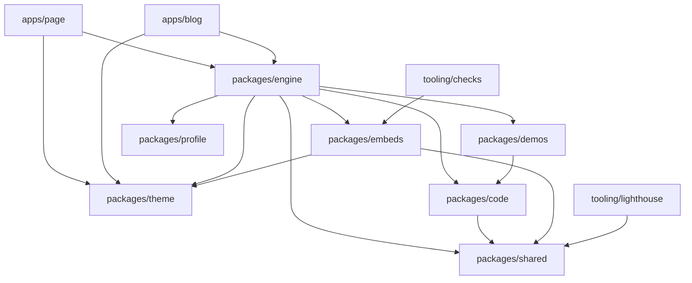
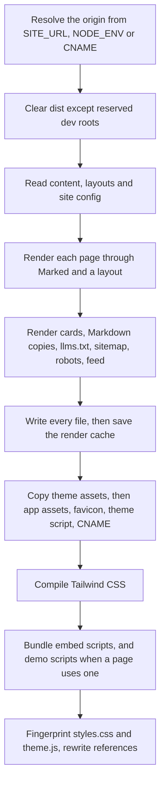
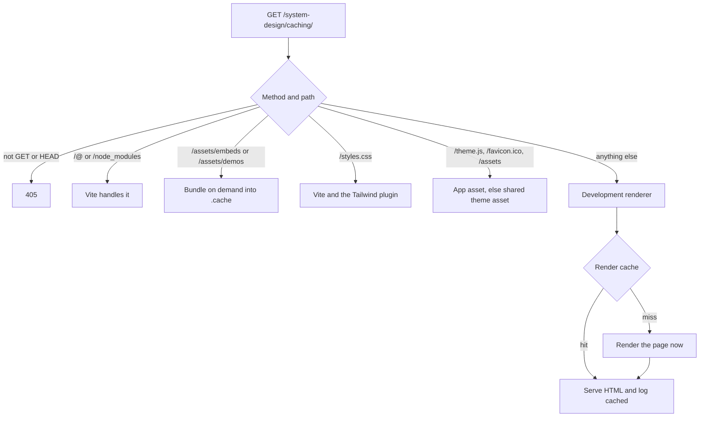
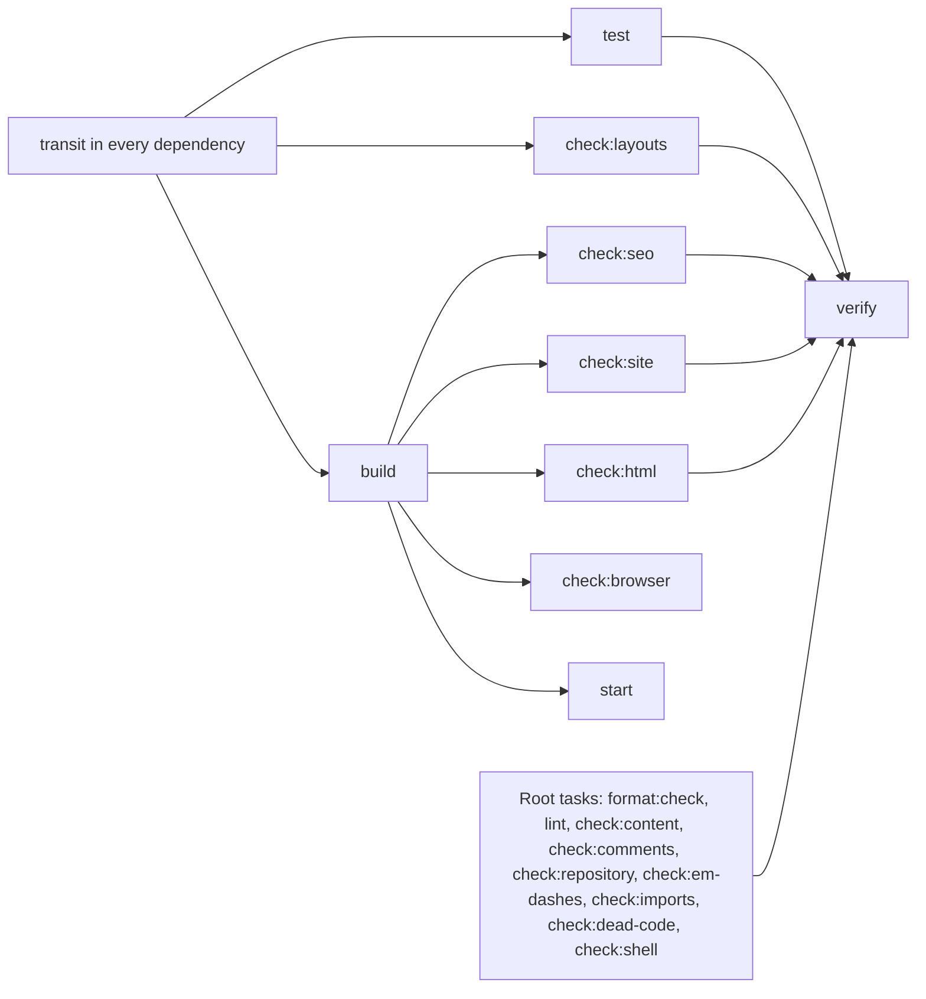

# Architecture

[Documentation index](index.md)

This document explains how the repository fits together: which workspace owns
which stage, how a Markdown file becomes a page during a build and during
development, what is cached where, and how Turborepo schedules the work. It is
the overview; [rendering flow](rendering-flow.md) follows a single page through
the same code in more detail, and [scripts and commands](scripts-and-commands.md)
documents every command.

## One generator, two sites

The repository holds two static sites and one generator. `apps/page` is
pulkit.page, the portfolio. `apps/blog` is pulkit.blog, every post. Neither app
contains JavaScript: each is a `content/` tree of Markdown, an `assets/` tree, a
one-line `styles.css`, a `CNAME`, and a `package.json` whose scripts call the
`site` CLI from `@pulkit/engine`.

Everything else lives in workspace packages that the engine imports by name:

| Workspace                                    | Package              | Owns                                                                       |
| -------------------------------------------- | -------------------- | -------------------------------------------------------------------------- |
| [packages/engine](../packages/engine/)       | `@pulkit/engine`     | Route discovery, rendering, layouts, SEO, build, dev server, output checks |
| [packages/theme](../packages/theme/)         | `@pulkit/theme`      | The single shared look: stylesheet, layouts, shared assets, theme script   |
| [packages/shared](../packages/shared/)       | `@pulkit/shared`     | HTML escaping and built-site walkers used by several workspaces            |
| [packages/code](../packages/code/)           | `@pulkit/code`       | Fence formatting, syntax highlighting, HTML pretty printing                |
| [packages/embeds](../packages/embeds/)       | `@pulkit/embeds`     | Markdown embeds, their browser scripts, and the bundler for both           |
| [packages/demos](../packages/demos/)         | `@pulkit/demos`      | Interactive motion demos behind `:::demo`, their styles, fonts and scripts |
| [packages/profile](../packages/profile/)     | `@pulkit/profile`    | Author name, profile URL, both site origins, default social links          |
| [tooling/checks](../tooling/checks/)         | `@pulkit/checks`     | Repository-wide gates, the policy tests, and the hook installer            |
| [tooling/lighthouse](../tooling/lighthouse/) | `@pulkit/lighthouse` | Parallel Lighthouse reports for both sites                                 |
| [tooling/benchmarks](../tooling/benchmarks/) |                      | The development server benchmark runner                                    |

The only workspace packages an app depends on are `@pulkit/engine` and
`@pulkit/theme`, alongside `html-validate` for its `check:html` script.
The engine depends on `@pulkit/code`, `@pulkit/demos`, `@pulkit/embeds`,
`@pulkit/profile`, `@pulkit/shared` and `@pulkit/theme`, so an edit in any of
them changes what the apps build.

No package has a build step. Their `exports` fields point at source files, and
the engine copies or bundles browser code into each app's `dist/` during a build.
Nothing is published to a registry; every dependency between workspaces uses a
`workspace:*` version.

## From Markdown to a page during a build

`bun run build` runs Turbo, which runs `site build` in each app with that app
directory as the working directory. Every relative path the engine uses
(`content/`, `assets/`, `styles.css`, `CNAME`, `dist/`, `.cache/`) therefore
resolves inside the app being built.

[build.ts](../packages/engine/src/commands/build.ts) drives those steps in order and
prints the duration of each one.

1. **Origin.** [resolveSiteOrigin](../packages/engine/src/site/site-origin.ts)
   returns `SITE_URL` when set, `http://127.0.0.1:<PORT>` under
   `NODE_ENV=development`, and `https://<CNAME>` for production. Any other
   `NODE_ENV` without `SITE_URL` fails. The origin is the only source of
   canonical URLs, so there is no `url` frontmatter field.
2. **Clear.** Everything in `dist/` except reserved `dev-<port>` directories is
   removed, so a renamed or deleted page leaves no stale output.
3. **Inventory.** [site-inventory.ts](../packages/engine/src/site/site-inventory.ts)
   walks `content/`, rejects symlinks and `.mdx`, maps each file to a route,
   rejects routes that collide after NFC and lowercase normalization, and
   requires a homepage. It then appends the shared not-found page from
   [not-found.ts](../packages/engine/src/site/not-found.ts), so both sites
   render the same `/404/` without a content file of their own. `readSiteConfig` merges
   [@pulkit/profile](../packages/profile/profile.json) under the app's
   `content/_site.md` and appends an RSS link when the site sets `articles`.
   `loadLayouts` reads the app's `layouts/` when it exists and the shared theme
   layouts otherwise. A list directive that names another site, such as
   `blog:all`, also makes the inventory read `../blog/content` so the list can
   link to the other site.
4. **Render.** For each page, [generate.ts](../packages/engine/src/site/generate.ts)
   asks the render cache for the HTML and renders it on a miss.
   [renderPage](../packages/engine/src/render/render-page.ts) validates the
   frontmatter, runs Marked with the project's renderer overrides and the
   `embed`, `demo`, `carousel` and `list` extensions, collects the styles and
   scripts the page actually used, builds the SEO head, fills a layout, and
   returns HTML formatted by
   [formatHtml](../packages/code/src/format/format-html.ts).
5. **Generated assets.** [og-images.ts](../packages/engine/src/seo/og-images.ts)
   rasterizes one 1200 by 630 PNG card per route with resvg, then adds
   `sitemap.xml`, `robots.txt`, `feed.xml` on sites with articles, and the
   Markdown copies and `llms.txt` from
   [markdown-export.ts](../packages/engine/src/markdown/markdown-export.ts).
6. **Write.** Only after every page and asset is in memory does the generator
   write files, so a rendering error cannot leave a half written page. It then
   saves the render cache and prints how many entries it had to compute.
7. **Assets.** `packages/theme/assets/` is copied into `dist/assets/`, the app's
   own `assets/` is copied on top of it, `favicon-32.png` becomes
   `dist/favicon.ico`, and the theme's `theme.js` is copied to the root. A
   production build also copies `CNAME`.
8. **Styles.** The Tailwind CLI compiles the app's one-line `styles.css` into
   minified `dist/styles.css`.
9. **Bundles.** `buildEmbedAssets` always writes `dist/assets/embeds/` plus the
   KaTeX and PhotoSwipe files it needs. `buildDemoAssets` runs only when some
   page body contains a demo directive, so pulkit.blog gets
   `dist/assets/demos/` and pulkit.page does not.
10. **Fingerprints.** `styles.css` and `theme.js` are renamed with the first 12
    hexadecimal characters of their SHA-256 digest, and every built HTML file is
    rewritten to reference the hashed names.

The not-found page is also written to `dist/404.html`, which is the file
GitHub Pages serves for every unmatched path.

A build of this repository writes 46 files for pulkit.page (14 pages plus the
`404.html` copy, 14 cards, 14 Markdown copies, `llms.txt`, `sitemap.xml`,
`robots.txt`) and 173 files for pulkit.blog (56 pages plus the `404.html` copy,
56 cards, 56 Markdown copies, `llms.txt`, `sitemap.xml`, `robots.txt`,
`feed.xml`), plus the copied and bundled assets. None of it is committed.

## From Markdown to a page during development

`bun run dev` starts one server per app. `site dev` runs
[dev.ts](../packages/engine/src/commands/dev.ts) under `bun --watch`, which creates a
Vite server in middleware mode. Vite supplies file watching, the browser reload
client, CSS hot replacement and HTML transforms; a single middleware supplies the
pages.

[dev-renderer.ts](../packages/engine/src/dev/dev-renderer.ts) reads the inventory
on the first request and keeps it until a watched file changes. It answers page
routes, social cards, `sitemap.xml`, `robots.txt`, `feed.xml`, every Markdown
copy and `llms.txt`, redirects a missing trailing slash, and renders the
not-found page with status 404 for anything else. It uses the same renderer, layouts, SEO helpers and render cache
as the build, so a page looks the same in both, except that its canonical URLs
use the bound loopback origin and Vite injects its client.

The watcher treats changes in three groups:

| Changed path                                                                                             | Effect                                                      |
| -------------------------------------------------------------------------------------------------------- | ----------------------------------------------------------- |
| `content/`, `layouts/`, `CNAME`, `packages/theme/layouts/`                                               | Drop the inventory, reload the browser, rerender on request |
| `packages/*/src/`, `packages/theme/assets/fonts/`, `packages/demos/showcases/`, `biome.json`, `bun.lock` | Also drop the render cache                                  |
| Anything else in `packages/demos/`                                                                       | Drop the demo bundle and styles, reload the browser         |

`preTransformRequests` is off because the embed and demo scripts are produced by
the middleware rather than read from disk, and Vite's file access is limited to
the app directory and the repository root so workspace packages can still be
served. Each page request logs one line with its status and whether the page was
`compiled`, `rebuilt` or `cached`. Rendering errors return 500 for that page and
the next request retries after a fix.

`site start` is a separate mode: it previews an existing `dist/` with Vite and
never renders anything. Port selection is shared by both
([port.ts](../packages/engine/src/lib/port.ts)): `PORT` wins and is
strict, `SITE_PORT` is a preference that falls forward to a free port, `PORT=0`
asks the operating system, and the default is 3000. pulkit.blog sets
`SITE_PORT=3001` in its `dev` and `start` scripts so both sites run together.

## The shared theme

Both sites look identical because both take their entire presentation from
`@pulkit/theme`:

- [styles.css](../packages/theme/styles.css) sets up the Tailwind theme and
  utilities layers without Preflight, declares `@source` entries for the theme's
  `layouts/`, the engine's `src/render/` modules, the code package's `highlight/token-role.ts`
  and the embed renderers, defines the `dark` variant for both the system
  preference and the `data-theme` override, declares the Comic Relief web fonts,
  replaces the default Tailwind theme with the site tokens, including the
  `--color-syn-*` syntax colors, and keeps the view transition rules that have
  no utility equivalent.
- [layouts/](../packages/theme/layouts/) holds `home`, `simple` and `article`
  plus the `head`, `header` and `footer` partials. Each app would override them
  by adding its own `layouts/` directory; neither does.
- `assets/` holds the favicons, the Comic Relief web fonts, the IBM Plex Mono
  TTF used only for social cards, and the author portrait.
- [theme.ts](../packages/theme/src/client/theme.ts) is loaded without `defer` in the head so
  a stored theme applies before the body renders. It also names the shared
  element for view transitions and skips the animation under reduced motion.
- [src/lib/files.ts](../packages/theme/src/lib/files.ts) resolves paths inside the
  package (`themeFile`) and maps a public `/assets/...` path to the app's own
  asset first and the shared asset second (`assetFile`).

Each app's `styles.css` is the single line
`@import "@pulkit/theme/styles.css";`, so Tailwind compiles one stylesheet per
site from the same source. Because Tailwind scans only the sources listed above,
a class has to appear there as a complete literal string.

## What the other packages contribute

`@pulkit/code` formats and highlights code at generate time and pretty prints the
final HTML. `formatFence` applies whitespace hygiene to every fence and formats
the languages Biome understands through Biome's JavaScript API, which is loaded
lazily on first use. `highlightFence` loads Shiki grammars on demand, maps
scopes to a small set of `text-syn-*` utility classes, and throws if
highlighting would change the fence text. `formatHtml` is a parse5 based printer
that indents blocks, keeps prose and inline elements on one line, and leaves the
text inside `pre` untouched.

`@pulkit/embeds` renders the block and inline embeds described in the
[authoring guide](authoring-guide.md#components) from a
[registry](../packages/embeds/src/renderers/registry.ts) of renderers, and also decides
which raw HTML tags are allowed in Markdown. Every renderer records
the stylesheet or script it needs, so a page carries only the assets it uses.
The browser half lives in `client/`, with one thin entry per script in
`client/entries/`, widget logic in `client/components/`, and shared helpers in
`client/lib/`; the entries are bundled with `Bun.build` and code
splitting.

`@pulkit/demos` renders a demo directive, with an optional variant, as a
`demo-showcase` custom element whose data comes from `showcases/*.json`. In the browser the element
attaches a shadow root, adopts the demo stylesheet, and loads the component with
a dynamic `import()` from [registry.ts](../packages/demos/client/registry.ts) once the
element scrolls near the viewport.

`@pulkit/shared` holds the two pieces that several workspaces need: `escapeHtml`
and the walkers that list the routes and files of a built site.
`@pulkit/profile` holds the author facts and both site origins, which is how a
list on one site can link to the other.

## Three layers of caching

Nothing generated is committed, so every layer below is disposable and can be
deleted to force a cold run.

| Layer             | Location                      | Key                                                                                    | Restores                       |
| ----------------- | ----------------------------- | -------------------------------------------------------------------------------------- | ------------------------------ |
| Turbo task cache  | `.turbo/cache`                | Task inputs, including the sources of every workspace dependency and the global inputs | The whole `dist/**` of a build |
| Render cache      | `apps/<app>/.cache/generate/` | A version hash of package sources plus the inputs of one page, fence or card           | One HTML page, fence or card   |
| Bun package cache | `~/.bun/install/cache`        | `bun.lock`                                                                             | Downloaded dependencies        |

The page app opts out of the Turbo layer. Its `build`, `check:seo`, `check:site`
and `check:html` tasks set `cache: false` in
[apps/page/turbo.json](../apps/page/turbo.json), because a projects directive
reads a GitHub starred list over the network at build time and Turbo
hashes only local files. Without the opt-out, rerunning an unchanged commit
replays an older `dist` and the Projects page keeps a stale list however many
times it is redeployed. The render cache still applies inside that build, so a
rebuild whose inputs did not change stays under a second.

[generation-cache.ts](../packages/engine/src/lib/generation-cache.ts) computes the
version from every non-test `packages/*/src/**/*.ts` file, the demo showcases, `biome.json`,
`bun.lock` and the bundled card font, so any change in generator behavior
invalidates it conservatively. Entries are stored per absolute output directory,
which keeps a build and a development server on the same checkout apart, are
verified against their own digest when read, are limited to the most recent
4,096, and are saved by writing a temporary file and renaming it. The cached
kinds are `html`, `fence` and `card`; a build prints the counts it had to
compute, and an empty count means everything was reused.

A page's HTML key contains its route, its source text, the expanded layouts, the
site configuration and its render dependencies (SEO head, breadcrumbs, related
navigation, category, and the resolved entries of every list directive on the
page). That is why editing one post's title also rerenders the pages that list
it, while editing its body does not.

Within one process there are smaller caches that need no invalidation: Shiki
grammars, the Biome workspace, and measured image dimensions.

## The Turborepo task graph

[turbo.json](../turbo.json) defines the graph. Workspace packages produce no
build output, so there is nothing for an app's `build` to depend on in the usual
sense. A `transit` task that depends on `^transit` exists only to connect them:
`build`, `test` and `check:layouts` depend on `^transit`, which folds the source
hash of every workspace dependency into the task hash. That is why an edit in
`packages/engine` or `packages/theme` invalidates both app builds.

`build` is the only task with outputs (`dist/**`), and `.cache/**` is excluded
from its inputs. `verify` aggregates everything except `check:browser`, which
needs a browser and runs in its own CI job, and `bun run ci` is
`turbo run verify`. `dev`, `start` and `clean` are never cached, and `dev` and
`start` are persistent.

Two files extend the root configuration:

- [apps/page/turbo.json](../apps/page/turbo.json) adds
  `$TURBO_ROOT$/apps/blog/content/**` to the inputs of its `build`, because the
  portfolio home lists the newest pulkit.blog posts and therefore depends on the
  other app's content.
- [tooling/checks/turbo.json](../tooling/checks/turbo.json) adds `.github/`,
  `.githooks/`, the root `turbo.json`, `package.json`, `knip.json` and every
  workspace manifest to the inputs of its `test`, because
  [policy-ci.test.ts](../tooling/checks/src/commands/policy-ci.test.ts) asserts facts
  about those files.

`biome.json` and `.htmlvalidate.json` are global dependencies, and `NODE_ENV`
and `SITE_URL` are global environment inputs, so changing any of them
invalidates every task.

## Gates, hooks and deployment

The same `bun run ci` runs locally, inside the pre-commit hook against the
staged snapshot, and in the Verify job of GitHub Actions. CI then runs the
browser smoke matrix against the uploaded build and, on `main`, deploys both
sites from the same run. See
[continuous integration](continuous-integration.md) for the jobs and the run
graph, [deployment](deployment.md) for how each site reaches GitHub Pages, and
[quality checks](quality-checks.md) for what each gate proves and what it misses.

## Further reading

- [Repository map](repository-map.md): every directory and root configuration file.
- [Rendering flow](rendering-flow.md): one page followed through the same code.
- [Scripts and commands](scripts-and-commands.md): every command and module.
- [Authoring guide](authoring-guide.md): the content schema and the directives.
- [SEO and environments](seo-and-environments.md): origins, metadata and generated files.
