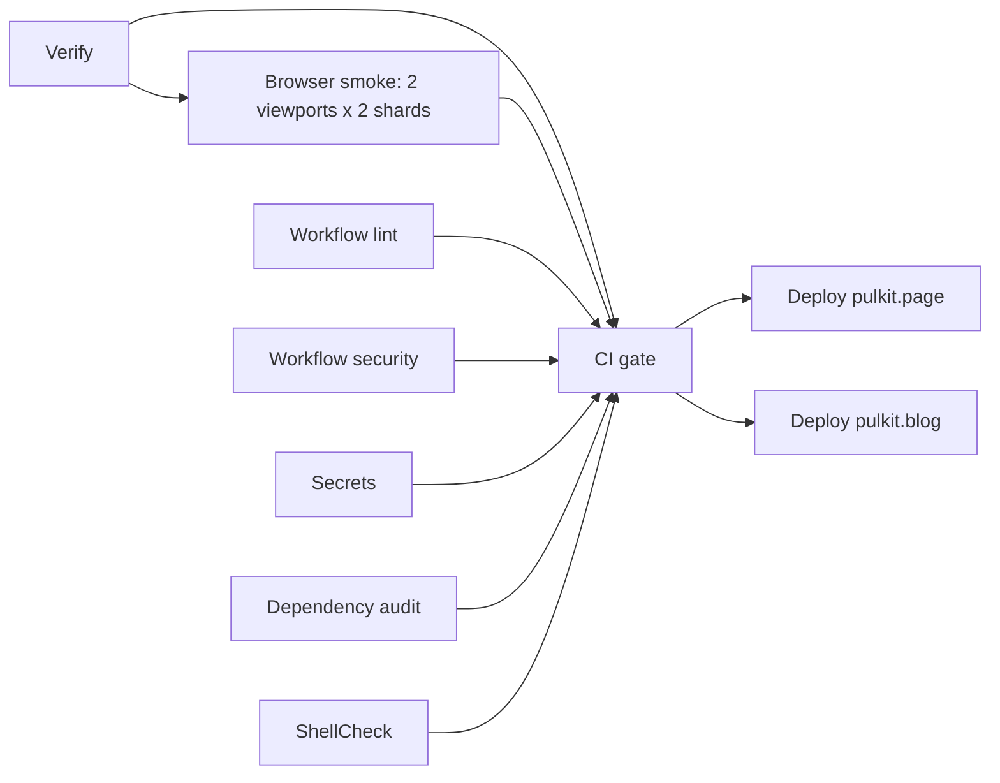

# Continuous integration

[Documentation index](index.md)

One workflow, [.github/workflows/ci.yml](../.github/workflows/ci.yml), runs every
check and both deployments. There is no second workflow file, and
[policy-ci.test.js](../tooling/checks/src/policy-ci.test.js) fails if one
appears without being accounted for.

## The same checks in three places

| Where               | Command                                             | Scope                                                         |
| ------------------- | --------------------------------------------------- | ------------------------------------------------------------- |
| A working checkout  | `bun run ci`                                        | The files on disk                                             |
| The pre-commit hook | `bun run ci` inside a copy of the staged index      | Exactly what the commit would contain                         |
| GitHub Actions      | `bun run ci` in the Verify job, then the other jobs | The pushed commit, plus browser, workflow and secret scanning |

`bun run ci` is `turbo run verify`. The [hook](../.githooks/pre-commit) is
installed by `bun install` through the root `postinstall` script, which runs
[install-hooks.sh](../tooling/checks/install-hooks.sh) and sets
`core.hooksPath` to `.githooks`. It copies the staged index into a temporary
directory with `git checkout-index`, initializes a throwaway repository there so
the Git based scanners see the same file list, installs with
`bun install --frozen-lockfile --ignore-scripts`, and runs `bun run ci` with
`TURBO_CACHE_DIR` pointing at the repository's `.turbo/cache` so unchanged tasks
replay from cache. Because it checks the index rather than the worktree, a fix
that is only unstaged still fails. [Scripts and commands](scripts-and-commands.md#staged-snapshot-pre-commit)
describes the hook in detail, and a
[test](../tooling/checks/src/pre-commit.test.js) pins that behavior.

## Triggers and concurrency

The workflow runs on pull requests, merge groups, pushes to `main`, and manual
dispatch. Its default permission is `contents: read`; only the pulkit.page deploy
job widens that, and only to `id-token: write` and `pages: write`.

Concurrency groups by pull request number, or by ref when there is no pull
request, with `cancel-in-progress: true`. A newer push therefore cancels the
older run everywhere, including on `main`. On `main` that can cancel an older run
while it is deploying, which is safe: a cancelled Pages deployment leaves the
previous site live, and the pulkit.blog publish is a single `git push` that
either happened or did not.

## The run graph

## The jobs

| Job                | What it runs                                                                 | Why it exists                                                                                    |
| ------------------ | ---------------------------------------------------------------------------- | ------------------------------------------------------------------------------------------------ |
| Verify             | `bun install --frozen-lockfile`, then `bun run ci`                           | The whole local gate: tests, both builds, layout and post-build checks, and the repository gates |
| Browser smoke      | `bunx turbo run check:browser --only` over a viewport and shard matrix       | Real browser behavior that static checks cannot prove                                            |
| Workflow lint      | actionlint                                                                   | Catches invalid workflow syntax, expressions and runner labels                                   |
| Workflow security  | zizmor with the pedantic persona and high minimum severity                   | Catches unpinned actions, credential persistence and injectable expressions                      |
| Secrets            | gitleaks over the directory                                                  | Catches committed credentials                                                                    |
| Dependency audit   | `bun audit --audit-level=high`                                               | Fails on high severity advisories in the locked dependency tree                                  |
| ShellCheck         | shellcheck on the hook and its installer                                     | The only two shell scripts in the repository                                                     |
| CI                 | Fails when any needed job failed, was cancelled or was skipped               | One required status to protect a branch with                                                     |
| Deploy pulkit.page | `upload-pages-artifact` and `deploy-pages` in the `github-pages` environment | Publishes `apps/page/dist` to this repository's Pages site                                       |
| Deploy pulkit.blog | Pushes `apps/blog/dist` to `gh-pages` in `pulkitxm/pulkit.blog`              | Publishes the second site, which needs its own repository                                        |

Verify is the only job that builds. It uploads `apps/*/dist` as the
`built-sites` artifact with a one day retention, and the browser and deploy jobs
download that artifact instead of building again, so every later job inspects or
publishes the exact bytes that were checked.

The browser matrix has four jobs: `desktop` and `mobile` crossed with shards
`1/2` and `2/2`, with `fail-fast: false`.
[check-browser.ts](../packages/engine/src/commands/check-browser.ts) reads
`BROWSER_VIEWPORT` and `BROWSER_SHARD`, audits every route but owns only the
shard's share of the assertions, and runs the whole-site flows (rendering without
JavaScript, the theme toggle, blocked storage, keyboard navigation and view
transitions) once, in the last viewport of the last shard. `PLAYWRIGHT_CHANNEL`
is set to `chrome`, so Playwright drives the Chrome already installed on the
runner and nothing is downloaded.

Both deploy jobs depend on the gate and run only for a push to `main` or a manual
dispatch on `main`. Because they are jobs of the same workflow, both deployments
appear in the same run graph as the checks that approved them. See
[deployment](deployment.md) for what each one does and the one-time setup behind
them.

## Pinning, timeouts and the policy tests

Every `uses:` reference is pinned to a 40 character commit SHA, and every job
sets `timeout-minutes`. Those are not conventions to remember:
[policy-ci.test.js](../tooling/checks/src/policy-ci.test.js) runs in
`bun run ci` and asserts them, along with the concurrency settings, the deploy
conditions, the absence of a second workflow file, and that every root and
workspace `check:*`, `lint`, `format:check` and `test` script is reachable from
`verify` or named in the workflow. A new check that nobody wired into `verify`
fails the tests instead of silently never running.

Bun is pinned to 1.4.2 in the workflow and in the root `packageManager` field.
All jobs run on `ubuntu-26.04`, which
[.github/actionlint.yaml](../.github/actionlint.yaml) registers because
actionlint does not yet know that label.

## Caches in CI

Every Bun job restores `~/.bun/install/cache` keyed on `bun.lock`. Verify also
restores `.turbo/cache` and `apps/*/.cache/generate` with a key containing the
commit SHA and a `turbo-<os>-` restore prefix, so a run starts from the most
recent previous run and only rerenders what changed. After `bun run ci` it
deletes Turbo cache files older than a week to keep the cache bounded. See
[architecture](architecture.md#three-layers-of-caching) for what each cache
holds.

Engine tests run with `bun test --timeout 30000` because the first fence test
loads Shiki grammars and Biome's WebAssembly while Turbo is building both sites
on a two core runner.

## What CI does not establish

The workflow proves that the committed sources build and pass every local gate,
and that the built output survives a browser audit. It does not verify DNS, Pages
settings, branch protection, environment approvals, external links, or that any
tutorial is still technically correct. Those need separate checks; see
[quality checks](quality-checks.md) for the full list of limits.
