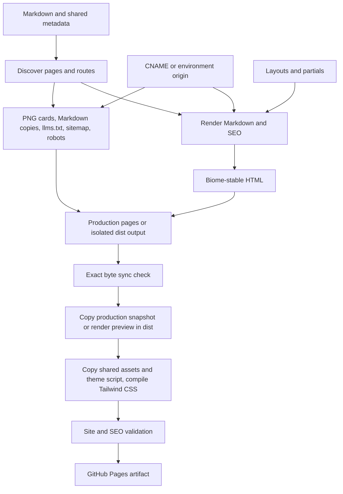

# Rendering and deployment flow

[Documentation index](index.md)

## The complete path

These are related operations rather than a single implicit pipeline. Default generation writes committed production output; check mode recomputes expected output without writing; development writes a separate directory. Build verifies committed production output first, then copies that snapshot into dist for the production origin. Other environments render their own output into dist.

## Discovery and routes

[generate.mjs](../scripts/generate.mjs) resolves the output directory, walks `content/`, rejects symlinks and MDX, and selects Markdown files except `_site.md`. `readPage` parses YAML/body; `_site.md` supplies shared metadata, augmented with an origin from [site-origin.mjs](../scripts/site-origin.mjs). Origin is not a frontmatter field.

| Source                                   | Default production output                      | Route                           |
| ---------------------------------------- | ---------------------------------------------- | ------------------------------- |
| `content/home.md`                        | `pages/index.html`                             | `/`                             |
| `content/about.md`                       | `pages/about/index.html`                       | `/about/`                       |
| `content/blogs/index.md`                 | `pages/blogs/index.html`                       | `/blogs/`                       |
| `content/blogs/system-design/caching.md` | `pages/blogs/system-design/caching/index.html` | `/blogs/system-design/caching/` |
| `content/blogs/system-design/index.md`   | `pages/blogs/system-design/index.html`         | `/blogs/system-design/`         |

`outputFor` also understands `content/index.md`, but strict authoring forbids it. Output paths are normalized to NFC and lowercase to reject collisions. A root output is required. Each discovered page carries source, metadata, body, route, and an index flag based on `/index.md`. Discovery finishes before rendering, so lists, breadcrumbs, related links, schema, and sitemap share the same page inventory.

## Markdown and collection rendering

[home.md](../content/home.md) requests five recent blog entries and three experience entries. The `listing` Marked extension selects descendants of the requested route prefix, excluding the current page and index pages. It sorts descending by date string, then title via `localeCompare`, and applies a positive limit. Missing dates sort behind dated entries. The row shows escaped title and period, or the date's year. Tags do not control collection membership.

At this snapshot the homepage's articles are Kaksha, Git partial clones, My First Talk, Git Worktrees, and Cookie Sync. Experience shows MagicAPI, CrowdVolt, and DatawaveLabs. DatawaveLabs precedes GeeksforGeeks when dates tie because of title sorting. Unknown/empty collections and malformed directives throw.

[caching.md](../content/blogs/system-design/caching.md) becomes `/blogs/system-design/caching/` and appears in both the broad writing list and system-design list. Marked renders prose, code, tables, and images. Fenced code is formatted during generation by [format-code.mjs](../scripts/format-code.mjs), then highlighted by [highlight.mjs](../scripts/highlight.mjs). Markdown sources keep authored fence bytes; only the generated HTML is cleaned. Programming fences get LF endings, trailing-space stripping, leading/trailing blank trimming, collapsed blank runs, and indent dedent (leading tabs become two spaces). Biome then formats `js`/`javascript`/`jsx`/`ts`/`typescript`/`tsx`/`json`/`jsonc`/`css`/`html`/`graphql` snippets with the repository config; parse failures keep the hygiene-normalized text and do not fail the build. `text`, `plaintext`, `txt`, `math`, and `mermaid` only strip trailing whitespace and trailing blanks. Shiki grammars load for languages that appear in fences; the HTML keeps `<pre><code class="language-…">` and adds spans with `text-syn-*` Tailwind utilities. Token colors live in [styles.css](../styles.css) as `--color-syn-*` theme variables that follow the existing light/dark mechanism. `text`, `plaintext`, `math`, `mermaid`, and unknown labels stay escaped plain text. No highlighter JavaScript is served. Raw HTML tokens are escaped; images get safe escaped URLs/alt text and lazy loading. Body headings become at least H2, receive normalized IDs, and get numeric suffixes for collisions; `main` is reserved. Original code-example comments remain literal text, not executable scripts.

The custom list is resolved during Marked parsing/rendering. There is no draft suppression, pagination, tag archive, or future-date scheduling. Separate related-writing logic now uses tags; see [SEO and environments](seo-and-environments.md).

## Templates, metadata, and navigation

`renderPage` uses explicit `layout` first; otherwise non-index blog routes use `article`, and collection indexes/other pages use `simple`. Home explicitly requests `home`. All layouts include a page H1 and shared head/header/footer; article/simple insert breadcrumbs before the article and related/collection navigation after it.

[loadLayouts](../scripts/layouts.mjs) reads layout and partial HTML, expands includes recursively, rejects missing partials/cycles/unknown or malformed placeholders, and requires exactly one content and heading placeholder in every expanded layout. Allowed values are title, description, brand, navigation, copyright, markdown, social, heading, content, date, seo, breadcrumbs, and related. `applyLayout` substitutes values in one pass, so user text resembling a placeholder is not evaluated again.

The full document title is `page title | brand`; there is no previous 55-character truncation. H1 is the full page title. Metadata and generated navigation labels are HTML-escaped. Description has renderer fallbacks, but strict content validation requires it on every page. Dates are validated by ISO parse-and-round-trip. Date without period produces a `time` element; experience role/period produce the detail line. A period alone without a role suppresses the date but does not trigger the paragraph.

Ordinary Markdown links use Marked's default link renderer; strict content checking is therefore part of the safety boundary. `safeUrl` is specifically applied to images, collection links, navigation, and social URLs. JSON-LD uses a separate escaping function to keep data from terminating its script element.

## Formatting, generated assets, and synchronization

[formatHtml](../scripts/format-html.mjs) invokes the installed Biome CLI on stdin with HTML filename and repository configuration, VCS disabled. It repeats until output is unchanged, with a five-pass limit, stopping immediately at convergence. A single pass does not produce stable HTML for the current templates, so the convergence guard is retained. Check marks use numeric HTML references to avoid a pinned Biome Unicode substitution. Failure to converge throws. The generator renders all expected HTML before writes, then [seoOutputs](../scripts/og-images.mjs) computes cards/sitemap/robots into buffers. Rendering failures occur before output mutation.

The selected output directory is owned entirely by generation. Any non-HTML file not in expected SEO assets is an extra, regardless of extension. In check mode, missing/stale generated assets are compared as buffers and HTML as exact strings. All PNGs are recomputed for a read-only sync check. Normal generation reuses verified cache entries for HTML, fences, and cards. Changes to titles, dates, tags, brand, origin, card font, or layouts can affect several outputs.

Default production inventories HTML across the repository, excluding the root `.git`, `node_modules`, `extras`, `dist`, and `layouts` directories. Nested similarly named folders under pages are not excluded. For environment-specific output, HTML inventory is limited to that selected directory.

Normal generation compares bytes and writes only changed or missing expected output but does not delete extras and ultimately fails if extras exist. `--clean` removes extra non-HTML output and orphan HTML within the selected output directory; empty HTML parent directories are pruned. Legacy HTML outside production pages still fails and must be reviewed manually. It is not an atomic filesystem transaction: extra-file failures occur after some writes, and I/O errors can interrupt progress.

## Build and publication

[build.mjs](../scripts/build.mjs) resolves the requested environment origin, then runs sync with production forced: `NODE_ENV=production`, empty `SITE_URL`, and `SITE_OUTPUT_DIR=pages`. Thus preview builds cannot bypass a stale production snapshot. After success it clears the deployment root while preserving reserved `dist/dev-<port>/` directories. In a production/default environment with the production origin, it copies verified `pages/` into `dist/`, including when SITE\_URL explicitly names that origin. Other environments invoke generation with `SITE_OUTPUT_DIR=dist`. Both paths copy source assets, theme JS, and `.nojekyll`, then the Tailwind CLI compiles `styles.css` into minified `dist/styles.css`. Only the production assembly includes CNAME.

No minification, browser bundling, source-image optimization, redirects, RSS/Atom feed, or search service is generated. SEO assets are generated, not copied from production for a preview. In default production, assembled dist output matches committed page output byte for byte; custom-origin output intentionally differs in canonicals, cards, schema, and crawler files.

The [GitHub workflow](../.github/workflows/ci.yml) runs quality and workflow-analysis jobs, then the CI gate. Main push or main manual dispatch uploads dist and deploys it to Pages after the gate. Pull requests and merge groups validate without deployment. Local CI rebuilds ignored dist but does not deploy. Live DNS, GitHub settings, and remote health require separate verification.

## Incremental development and caches

Vite serves HTML and social cards on demand using the same validated inventory, templates, renderer, and SEO helpers as production generation. Discovery and metadata parsing cover the source tree, but only requested pages are rendered. Keys include route, source text, expanded layouts, shared metadata, and actual SEO, breadcrumb, related-navigation, and listing inputs. Body edits invalidate their page; metadata changes also invalidate affected listings and navigation. Route additions and deletions update inventory and crawler responses.

`.cache/generate/` stores disposable, checksummed entries isolated by absolute output identity, including the development port. HTML, code fences, and cards persist across restarts. Script contents, Biome configuration, dependency lockfile, and the bundled card font invalidate the cache conservatively. Up to 4,096 prior entries are retained when loading. Missing or corrupt entries recompute. Failed asynchronous renders are removed from pending work so subsequent requests can retry.

`--check` never reads or writes the persistent cache and remains the full source-of-truth comparison. Default generation retains extra-file diagnostics; `--clean` renders every HTML page and removes orphan output. Production builds still verify all pages because the deployment is static.

Shiki is shared within the development process and loads requested languages. Bun watches imported server code for restarts. Vite injects its development client for browser reloads, and the Tailwind Vite plugin compiles `styles.css` with CSS hot replacement; production output has no Vite client. Biome convergence remains checked. See [development benchmarks](development-benchmarks.md) for measurements and limitations.
