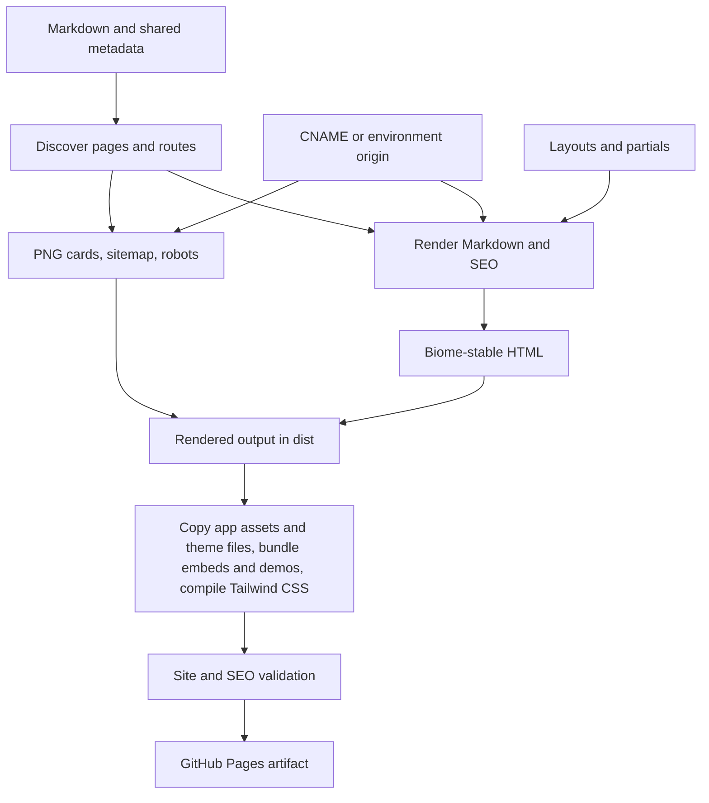

# Rendering and deployment flow

[Documentation index](index.md)

## The complete path

Build runs this path for the production origin or a preview origin and writes everything into `apps/page/dist/`; nothing generated is committed. Development renders the same pages on request instead of writing a full build.

## Package boundaries

| Stage                                                         | Owner                                             |
| ------------------------------------------------------------- | ------------------------------------------------- |
| Content, layouts, assets, CNAME                               | `apps/page`, read relative to the app directory   |
| Discovery, rendering, SEO, build                              | `packages/engine`, invoked through the `site` CLI |
| Fence formatting and highlighting, HTML formatting            | `packages/code`                                   |
| `:::embed` and `:embed[...]` blocks and their browser scripts | `packages/embeds`                                 |
| `:::demo` blocks, demo CSS, fonts, and scripts                | `packages/demos`                                  |
| Tailwind base, theme script, fonts, icons                     | `packages/theme`                                  |
| Content, comment, text, and repository gates                  | `tooling/checks`, run from the root               |

The app has no code of its own: its scripts call the engine, and the engine imports the other packages by their workspace names. Because the engine reads `content/`, `layouts/`, `assets/`, `styles.css`, and `CNAME` from the current directory, the same engine can build any app under `apps/`.

## Discovery and routes

[site-inventory.mjs](../packages/engine/src/site-inventory.mjs) walks the app's `content/`, rejects symlinks and MDX, and selects Markdown files except `_site.md`. `readPage` parses YAML/body; `_site.md` supplies shared metadata, augmented with an origin from [site-origin.mjs](../packages/engine/src/site-origin.mjs). Origin is not a frontmatter field.

Paths below are relative to `apps/page/`.

| Source                                   | Build output                                  | Route                           |
| ---------------------------------------- | --------------------------------------------- | ------------------------------- |
| `content/home.md`                        | `dist/index.html`                             | `/`                             |
| `content/about.md`                       | `dist/about/index.html`                       | `/about/`                       |
| `content/blogs/index.md`                 | `dist/blogs/index.html`                       | `/blogs/`                       |
| `content/blogs/system-design/caching.md` | `dist/blogs/system-design/caching/index.html` | `/blogs/system-design/caching/` |
| `content/blogs/system-design/index.md`   | `dist/blogs/system-design/index.html`         | `/blogs/system-design/`         |

Discovery also understands `content/index.md`, but strict authoring forbids it. Routes are normalized to NFC and lowercase to reject collisions, and root `dev-<port>` routes are reserved for development output. A root page is required. Each discovered page carries source, metadata, body, route, and an index flag based on `/index.md`. Discovery finishes before rendering, so lists, breadcrumbs, related links, schema, and sitemap share the same page inventory.

## Markdown and collection rendering

[home.md](../apps/page/content/home.md) requests five recent blog entries and three experience entries. The `listing` Marked extension selects descendants of the requested route prefix, excluding the current page and index pages. It sorts descending by date string, then title via `localeCompare`, and applies a positive limit. Missing dates sort behind dated entries. The row shows escaped title and period, or the date's year. Tags do not control collection membership.

At this snapshot the homepage's articles are Kaksha, Git partial clones, My First Talk, Git Worktrees, and Cookie Sync. Experience shows MagicAPI, CrowdVolt, and DatawaveLabs. DatawaveLabs precedes GeeksforGeeks when dates tie because of title sorting. Unknown/empty collections and malformed directives throw.

[caching.md](../apps/page/content/blogs/system-design/caching.md) becomes `/blogs/system-design/caching/` and appears in both the broad writing list and system-design list. Marked renders prose, code, tables, and images. Fenced code is formatted during generation by the `@pulkit/code` package's [format-code.mjs](../packages/code/src/format-code.mjs), then highlighted by [highlight.mjs](../packages/code/src/highlight.mjs). Markdown sources keep authored fence bytes; only the generated HTML is cleaned. Programming fences get LF endings, trailing-space stripping, leading/trailing blank trimming, collapsed blank runs, and indent dedent (leading tabs become two spaces). Biome then formats `js`/`javascript`/`jsx`/`ts`/`typescript`/`tsx`/`json`/`jsonc`/`css`/`html`/`graphql` snippets with the repository config; parse failures keep the hygiene-normalized text and do not fail the build. `text`, `plaintext`, `txt`, `math`, and `mermaid` only strip trailing whitespace and trailing blanks. Shiki grammars load for languages that appear in fences; the HTML keeps `<pre><code class="language-…">` and adds spans with `text-syn-*` Tailwind utilities. Token colors live in the app's [styles.css](../apps/page/styles.css) as `--color-syn-*` theme variables that follow the existing light/dark mechanism. `text`, `plaintext`, `math`, `mermaid`, and unknown labels stay escaped plain text. No highlighter JavaScript is served. Raw HTML tokens are escaped; images get safe escaped URLs/alt text and lazy loading. Body headings become at least H2, receive normalized IDs, and get numeric suffixes for collisions; `main` is reserved. Original code-example comments remain literal text, not executable scripts.

The custom list is resolved during Marked parsing/rendering. The same Marked setup recognizes block and inline embed syntax, rendered by `@pulkit/embeds`, and demo directives, rendered by `@pulkit/demos` from its JSON showcases. A page that uses them gets the matching stylesheet and script tags for `/assets/embeds/` or `/assets/demos/`. There is no draft suppression, pagination, tag archive, or future-date scheduling. Separate related-writing logic now uses tags; see [SEO and environments](seo-and-environments.md).

## Templates, metadata, and navigation

`renderPage` uses explicit `layout` first; otherwise non-index blog routes use `article`, and collection indexes/other pages use `simple`. Home explicitly requests `home`. All layouts include a page H1 and shared head/header/footer; article/simple insert breadcrumbs before the article and related/collection navigation after it.

[loadLayouts](../packages/engine/src/layouts.mjs) reads layout and partial HTML, expands includes recursively, rejects missing partials/cycles/unknown or malformed placeholders, and requires exactly one content and heading placeholder in every expanded layout. Allowed values are title, description, brand, navigation, copyright, social, heading, content, date, seo, breadcrumbs, and related. `applyLayout` substitutes values in one pass, so user text resembling a placeholder is not evaluated again.

The full document title is `page title | brand`; there is no previous 55-character truncation. H1 is the full page title. Metadata and generated navigation labels are HTML-escaped. Description has renderer fallbacks, but strict content validation requires it on every page. Dates are validated by ISO parse-and-round-trip. Date without period produces a `time` element; experience role/period produce the detail line. A period alone without a role suppresses the date but does not trigger the paragraph.

Ordinary Markdown links use Marked's default link renderer; strict content checking is therefore part of the safety boundary. `safeUrl` is specifically applied to images, collection links, navigation, and social URLs. JSON-LD uses a separate escaping function to keep data from terminating its script element.

## Formatting and generated assets

[formatHtml](../packages/code/src/format-html.mjs) in `@pulkit/code` invokes the installed Biome CLI on stdin with HTML filename and the root `biome.json`, VCS disabled. It repeats until output is unchanged, with a five-pass limit, stopping immediately at convergence. A single pass does not produce stable HTML for the current templates, so the convergence guard is retained. Check marks use numeric HTML references to avoid a pinned Biome Unicode substitution. Failure to converge throws. [generate.mjs](../packages/engine/src/generate.mjs) renders all expected HTML, then [seoOutputs](../packages/engine/src/og-images.mjs) computes cards/sitemap/robots into buffers, and only then writes files. Rendering failures occur before any page is written.

Rendering reuses verified cache entries for HTML, fences, and cards. Changes to titles, dates, tags, brand, origin, card font, or layouts can affect several outputs. Because build clears `dist/` first, removed or renamed pages leave no stale output behind. A failed build can leave `dist/` partially written; rerun the build after fixing the error.

## Build and publication

[build.mjs](../packages/engine/src/build.mjs) resolves the requested environment origin, clears the deployment root while preserving reserved `dist/dev-<port>/` directories, and calls `generateSite("dist", origin)` to render every page, card, sitemap, and robots file. It then copies the app's `assets/` into `dist/assets/`, copies `fonts/` and `icons/` from `@pulkit/theme` into `dist/assets/fonts/` and `dist/assets/`, and copies the theme's `theme.js`. The Tailwind CLI compiles the app's `styles.css`, which imports `@pulkit/theme/base.css`, into minified `dist/styles.css`. `buildDemoAssets` from `@pulkit/demos` writes `dist/assets/demos/` and `buildEmbedAssets` from `@pulkit/embeds` writes `dist/assets/embeds/` plus KaTeX and PhotoSwipe assets. Finally the stylesheet and theme script are fingerprinted and every page is rewritten to point at the hashed names. Only a production build with the production origin includes CNAME, including when SITE\_URL explicitly names that origin.

Only the stylesheet and the embed and demo bundles are minified; no source-image optimization, redirects, RSS/Atom feed, or search service is generated. SEO assets are rendered for the selected origin; custom-origin output intentionally differs from production in canonicals, cards, schema, and crawler files.

The [GitHub workflow](../.github/workflows/ci.yml) runs quality and workflow-analysis jobs, then the CI gate. Main push or main manual dispatch uploads `apps/page/dist` and deploys it to Pages after the gate. Pull requests and merge groups validate without deployment. Local CI rebuilds ignored dist but does not deploy. Live DNS, GitHub settings, and remote health require separate verification.

## Incremental development and caches

Vite serves HTML and social cards on demand using the same validated inventory, templates, renderer, and SEO helpers as the build. Discovery and metadata parsing cover the source tree, but only requested pages are rendered. Keys include route, source text, expanded layouts, shared metadata, and actual SEO, breadcrumb, related-navigation, and listing inputs. Body edits invalidate their page; metadata changes also invalidate affected listings and navigation. Route additions and deletions update inventory and crawler responses.

The app's `.cache/generate/` stores disposable, checksummed entries isolated by absolute output identity, including the development port. HTML, code fences, and cards persist across restarts. The cache version hashes every `packages/*/src/*.mjs` file, the demo showcases, the root `biome.json`, `bun.lock`, and the bundled card font, so any engine, code, embed, or demo source change invalidates it conservatively. Up to 4,096 prior entries are retained when loading. Missing or corrupt entries recompute. Failed asynchronous renders are removed from pending work so subsequent requests can retry.

Builds use the same cache, so a rebuild re-renders only what changed. Every build still writes all pages because the deployment is static. Delete `apps/page/.cache/generate/` to force a cold render. One level up, Turbo caches the whole `build` task: when neither the app nor any workspace package it depends on has changed, `bun run build` restores `dist/` from `.turbo/` without running the engine at all.

Shiki is shared within the development process and loads requested languages. Bun watches imported engine code for restarts. Embed and demo scripts are bundled into the app's `.cache/` on request. Vite injects its development client for browser reloads, and the Tailwind Vite plugin compiles the app's `styles.css` with CSS hot replacement; production output has no Vite client. Biome convergence remains checked. See [development benchmarks](development-benchmarks.md) for measurements and limitations.
