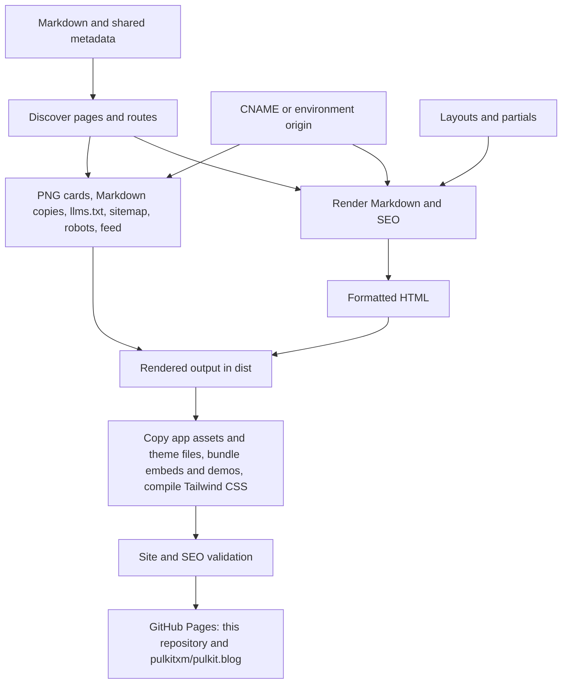

# Rendering and deployment flow

[Documentation index](index.md) · [Architecture](architecture.md)

This walkthrough follows real pages through the code. For the shorter overview of
the same path, the caching layers, and the Turborepo task graph, read
[architecture](architecture.md).

## The complete path

Build runs this path once per app, for the production origin or a preview origin, and writes everything into that app's `dist/` (`apps/page/dist/` or `apps/blog/dist/`); nothing generated is committed. Development renders the same pages on request instead of writing a full build.

## Package boundaries

| Stage                                                         | Owner                                                           |
| ------------------------------------------------------------- | --------------------------------------------------------------- |
| Content, assets, CNAME                                        | `apps/page` and `apps/blog`, read relative to the app directory |
| Discovery, rendering, SEO, build                              | `packages/engine`, invoked through the `site` CLI               |
| Fence formatting and highlighting, HTML formatting            | `packages/code`                                                 |
| HTML escaping and built-site walking                          | `packages/shared`                                               |
| `:::embed` and `:embed[...]` blocks and their browser scripts | `packages/embeds`                                               |
| `:::demo` blocks, demo CSS, fonts, and scripts                | `packages/demos`                                                |
| Stylesheet, layouts, shared assets, theme script              | `packages/theme`                                                |
| Author name, profile URL, default social links                | `packages/profile`                                              |
| Content, comment, text, and repository gates                  | `tooling/checks`, run from the root                             |

The apps have no code of their own: their scripts call the engine, and the engine imports the other packages by their workspace names. Because the engine reads `content/`, `assets/`, `styles.css`, and `CNAME` from the current directory, and takes layouts from the app's `layouts/` only when it exists (otherwise from `packages/theme/layouts/`), the same engine builds both apps under `apps/`.

## Discovery and routes

[site-inventory.ts](../packages/engine/src/site/site-inventory.ts) walks the app's `content/`, rejects symlinks and MDX, and selects Markdown files except `_site.md`. `readPage` parses YAML/body, and the shared not-found page from [not-found.ts](../packages/engine/src/site/not-found.ts) joins the inventory after them. `readSiteConfig` builds the site configuration: the author name and profile URL from [@pulkit/profile](../packages/profile/profile.json), then the app's `_site.md`, with social links taken from `_site.md` or else the profile, an RSS link to `/feed.xml` appended when `articles` is set, and an origin from [site-origin.ts](../packages/engine/src/site/site-origin.ts). Origin is not a frontmatter field.

Paths below are relative to the app named in the first column.

| App         | Source                             | Build output                              | Route                     |
| ----------- | ---------------------------------- | ----------------------------------------- | ------------------------- |
| `apps/page` | `content/home.md`                  | `dist/index.html`                         | `/`                       |
| `apps/page` | `content/about.md`                 | `dist/about/index.html`                   | `/about/`                 |
| `apps/page` | `content/exp/magicapi.md`          | `dist/exp/magicapi/index.html`            | `/exp/magicapi/`          |
| `apps/blog` | `content/home.md`                  | `dist/index.html`                         | `/`                       |
| `apps/blog` | `content/git-worktrees.md`         | `dist/git-worktrees/index.html`           | `/git-worktrees/`         |
| `apps/blog` | `content/system-design/index.md`   | `dist/system-design/index.html`           | `/system-design/`         |
| `apps/blog` | `content/system-design/caching.md` | `dist/system-design/caching/index.html`   | `/system-design/caching/` |
| both        | the engine's not-found page        | `dist/404/index.html` and `dist/404.html` | `/404/`                   |

Discovery also understands `content/index.md`, but strict authoring forbids it. Routes are normalized to NFC and lowercase to reject collisions, and root `dev-<port>` routes and `/404/` are reserved, the first for development output and the second for the shared not-found page. A root page is required. Each discovered page carries source, metadata, body, route, and an index flag based on `/index.md`. Discovery finishes before rendering, so lists, breadcrumbs, related links, schema, and sitemap share the same page inventory.

## Markdown and collection rendering

pulkit.page's [home.md](../apps/page/content/home.md) requests three experience entries and the five newest pulkit.blog posts through `blog:all`, which the site inventory reads from `apps/blog/content` and links to pulkit.blog; pulkit.blog's [home.md](../apps/blog/content/home.md) requests every post grouped by year. The `listing` Marked extension selects descendants of the requested route prefix, excluding the current page and index pages; the collection `all` instead selects every article page of the site. It sorts descending by date string, then title via `localeCompare`, and applies a positive limit. Missing dates sort behind dated entries. An ungrouped row shows escaped title and period, or the date's month and year. With `by-year`, rows are grouped under year headings and show the day and month. Tags do not control collection membership.

At this snapshot pulkit.page's home shows MagicAPI, CrowdVolt, and DatawaveLabs. DatawaveLabs precedes GeeksforGeeks when dates tie because of title sorting. Unknown/empty collections and malformed directives throw.

[caching.md](../apps/blog/content/system-design/caching.md) becomes `/system-design/caching/` on pulkit.blog and appears in both the blog home's list and the system-design list. Marked renders prose, code, tables, and images. Every rendered code block is wrapped in a scrolling `pre` with a sticky copy button, and the page loads `/assets/embeds/code-copy.js` once if it has any. Fenced code is formatted during generation by the `@pulkit/code` package's [format-code.ts](../packages/code/src/format/format-code.ts), then highlighted by [highlight.ts](../packages/code/src/highlight/highlight.ts). Markdown sources keep authored fence bytes; only the generated HTML is cleaned. Programming fences get LF endings, trailing-space stripping, leading/trailing blank trimming, collapsed blank runs, and indent dedent (leading tabs become two spaces). Biome then formats `js`/`javascript`/`jsx`/`ts`/`typescript`/`tsx`/`json`/`jsonc`/`css`/`html`/`graphql` snippets with the repository config; parse failures keep the hygiene-normalized text and do not fail the build. `text`, `plaintext`, `txt`, `math`, and `mermaid` only strip trailing whitespace and trailing blanks. Shiki grammars load for languages that appear in fences; the HTML keeps `<pre><code class="language-…">` and adds spans with `text-syn-*` Tailwind utilities. Token colors live in the shared [styles.css](../packages/theme/styles.css) as `--color-syn-*` theme variables that follow the existing light/dark mechanism. `text`, `plaintext`, `math`, `mermaid`, and unknown labels stay escaped plain text. No highlighter JavaScript is served. Raw HTML goes through `renderRawHtml` in `@pulkit/embeds`, which allows a small reviewed set of tags, adds their utility classes, rejects every other tag and attribute, and escapes the remaining text; images get safe escaped URLs and alt text, lazy loading, and a lightbox link unless they are the portrait or already inside a link. Body headings become at least H2, receive normalized IDs, and get numeric suffixes for collisions; `main` is reserved. Original code-example comments remain literal text, not executable scripts.

The custom list is resolved during Marked parsing/rendering. The same Marked setup recognizes block and inline embed syntax, rendered by `@pulkit/embeds`, and demo directives, rendered by `@pulkit/demos` from its JSON showcases. A page that uses them gets the matching stylesheet and script tags for `/assets/embeds/` or `/assets/demos/`. There is no draft suppression, pagination, tag archive, or future-date scheduling. Separate related-writing logic now uses tags; see [SEO and environments](seo-and-environments.md).

## Templates, metadata, and navigation

`renderPage` uses explicit `layout` first; otherwise article pages (non-index pages under the site's `articles` prefix, excluding home) use `article`, and collection indexes/other pages use `simple`. Both homes explicitly request `home`. All layouts include a page H1 and shared head/header/footer and place related/collection navigation after the content and breadcrumbs before it. The article layout also shows the author byline with the portrait.

[loadLayouts](../packages/engine/src/render/layouts.ts) reads layout and partial HTML from `layoutDirectory()` (the app's `layouts/` when present, otherwise `packages/theme/layouts/`), expands includes recursively, rejects missing partials/cycles/unknown or malformed placeholders, and requires exactly one content and heading placeholder in every expanded layout. Allowed values are title, description, brand, navigation, copyright, markdown, social, heading, content, date, seo, breadcrumbs, related, author, and authorUrl. `applyLayout` substitutes values in one pass, so user text resembling a placeholder is not evaluated again.

The full document title is `page title | brand`, or only the page title when that would exceed 70 characters. H1 is the full page title. Metadata and generated navigation labels are HTML-escaped. Description has renderer fallbacks, but strict content validation requires it on every page. Dates are validated by ISO parse-and-round-trip. On article pages the `date` placeholder holds a meta line: the long date in a `time` element, the reading time (words outside fenced code divided by 230, rounded, at least one minute), and a link to the parent category index when one exists, separated by middle dots. Elsewhere, date without period produces a `time` element; experience role/period produce the detail line. A period alone without a role suppresses the date but does not trigger the paragraph.

Ordinary Markdown links use Marked's default link renderer; strict content checking is therefore part of the safety boundary. `safeUrl` is specifically applied to images, carousel slides, collection links, navigation, and social URLs, and `escapeHtml` from `@pulkit/shared` escapes every interpolated value. JSON-LD uses a separate escaping function to keep data from terminating its script element.

## Formatting and generated assets

[formatHtml](../packages/code/src/format/format-html.ts) in `@pulkit/code` parses the rendered page with parse5 and prints it in one pass. Block elements are indented, a run of inline content stays on one line so no space appears before punctuation, void elements are written self-closing, raw text elements such as `script` and `style` are left alone, and the text inside `pre` keeps its exact bytes while the opening tag gets its own line. The printer writes the check mark U+2714 as the numeric reference `&#10004;`, which keeps highlighted shell transcripts stable. It replaced an earlier pass that shelled out to Biome and had to be repeated until the output stopped changing. [generate.ts](../packages/engine/src/site/generate.ts) renders all expected HTML, then [cardOutputs](../packages/engine/src/seo/og-images.ts), [crawlerOutputs](../packages/engine/src/seo/crawler-outputs.ts), and [markdownOutputs](../packages/engine/src/markdown/markdown-export.ts) compute cards, sitemap, robots, (for sites with articles) the Atom feed, and Markdown copies into buffers, and only then writes files. Rendering failures occur before any page is written.

Rendering reuses verified cache entries for HTML, fences, and cards. Changes to titles, dates, tags, brand, origin, card font, card category, or layouts can affect several outputs. Because build clears `dist/` first, removed or renamed pages leave no stale output behind. A failed build can leave `dist/` partially written; rerun the build after fixing the error.

## Build and publication

[build.ts](../packages/engine/src/commands/build.ts) resolves the requested environment origin, clears the deployment root while preserving reserved `dist/dev-<port>/` directories, and calls `generateSite("dist", origin)` to render every page, card, Markdown copy, `llms.txt`, sitemap, robots file, and feed. The not-found page is written twice, at its own route and at `dist/404.html` for GitHub Pages. It then copies `packages/theme/assets/` into `dist/assets/`, copies the app's `assets/` on top of it, copies `favicon-32.png` to `dist/favicon.ico`, and copies the theme's `theme.js`. The Tailwind CLI compiles the app's `styles.css`, which only imports `@pulkit/theme/styles.css`, into minified `dist/styles.css`. When any page body contains a demo directive, `buildDemoAssets` from `@pulkit/demos` writes `dist/assets/demos/` (so pulkit.blog gets it and pulkit.page skips it), and `buildEmbedAssets` from `@pulkit/embeds` writes `dist/assets/embeds/` plus KaTeX and PhotoSwipe assets. Finally the stylesheet and theme script are fingerprinted and every page is rewritten to point at the hashed names. Only a production build with the production origin includes CNAME, including when SITE\_URL explicitly names that origin.

Only the stylesheet and the embed and demo bundles are minified; no source-image optimization, redirects, or search service is generated. SEO assets are rendered for the selected origin; custom-origin output intentionally differs from production in canonicals, cards, schema, and crawler files.

The [GitHub workflow](../.github/workflows/ci.yml) runs quality and workflow-analysis jobs, then the CI gate. It builds and checks both apps; after the gate passes on a main push or main manual dispatch, its deploy jobs deploy `apps/page/dist` to this repository's Pages and publishes `apps/blog/dist` to the pulkitxm/pulkit.blog Pages branch, as described in [deployment](deployment.md). Pull requests and merge groups validate without deployment. Local CI rebuilds ignored dist but does not deploy. Live DNS, GitHub settings, and remote health require separate verification.

## Incremental development and caches

Vite serves HTML and social cards on demand using the same validated inventory, templates, renderer, and SEO helpers as the build. Discovery and metadata parsing cover the source tree, but only requested pages are rendered. Keys include route, source text, expanded layouts, shared metadata, and actual SEO, breadcrumb, related-navigation, and listing inputs. Body edits invalidate their page; metadata changes also invalidate affected listings and navigation. Route additions and deletions update inventory and crawler responses.

The app's `.cache/generate/` stores disposable, checksummed entries isolated by absolute output identity, including the development port. HTML, code fences, and cards persist across restarts. The cache version hashes every non-test `packages/*/src/**/*.ts` file, the demo showcases, the root `biome.json`, `bun.lock`, and the bundled card font, so any engine, code, embed, or demo source change invalidates it conservatively. Up to 4,096 prior entries are retained when loading. Missing or corrupt entries recompute. Failed asynchronous renders are removed from pending work so subsequent requests can retry.

Builds use the same cache, so a rebuild re-renders only what changed. Every build still writes all pages because the deployment is static. Delete `apps/<app>/.cache/generate/` to force a cold render. One level up, Turbo caches the whole `build` task: when neither the app nor any workspace package it depends on has changed, `bun run build` restores `dist/` from `.turbo/` without running the engine at all.

Shiki is shared within the development process and loads requested languages. Bun watches imported engine code for restarts. Embed and demo scripts are bundled into the app's `.cache/` on request. Vite injects its development client for browser reloads, and the Tailwind Vite plugin compiles the app's `styles.css` with CSS hot replacement; edits to the shared layouts in `packages/theme/layouts/` invalidate rendered pages like app content edits; production output has no Vite client. See [development benchmarks](development-benchmarks.md) for measurements and limitations.
