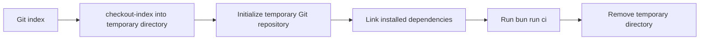

# Scripts and commands

[Documentation index](index.md)

## Runtime and dependencies

Run commands from the repository root with Bun and installed dependencies. Most scripts use Node-compatible filesystem/process APIs under Bun. `dev.mjs` runs Vite under Bun, and tests use `bun:test`. Shell wrappers require POSIX `sh`; repository checks and the hook require Git. Missing dependencies, files, parse errors, or failed subprocesses generally abort with a nonzero exit rather than being repaired automatically.

This inventory reflects merged commit `d0e897b`. New package commands named `check:*` are automatically included in the CI runner. Environment/output rules are detailed in [SEO and environments](seo-and-environments.md).

## Package command reference

| Command                    | Implementation and inputs                                                                               | Output, side effects, failure behavior                                                                                       |
| -------------------------- | ------------------------------------------------------------------------------------------------------- | ---------------------------------------------------------------------------------------------------------------------------- |
| `bun run dev`              | [dev.mjs](../scripts/dev.mjs) and [dev-renderer.mjs](../scripts/dev-renderer.mjs)                       | Starts Vite on loopback, renders requested routes, caches results, reloads browser after edits                               |
| `bun run generate`         | [generate.sh](../scripts/generate.sh) changes to root, executes [generate.mjs](../scripts/generate.mjs) | Writes HTML, cards, sitemap and robots to selected output; production defaults to pages                                      |
| `bun run generate --clean` | Same renderer and inventory                                                                             | Also deletes orphan HTML and extra non-HTML assets in selected output; never cleans legacy HTML elsewhere                    |
| `bun run check:generated`  | [check-sync.sh](../scripts/check-sync.sh) invokes generation with `--check`                             | Recomputes all expected HTML and SEO assets; read-only comparison; honors environment/output selection                       |
| `bun run build`            | [build.mjs](../scripts/build.mjs), production sync then assembly or preview render                      | Preserves dev roots, assembles verified production pages or renders previews, then copies shared assets; never repairs pages |
| `bun start`                | [start.mjs](../scripts/start.mjs), Vite preview                                                         | Serves existing dist on loopback port 3000, trying higher ports when occupied; no compilation or watching; requires a build  |
| `bun dev:clean`            | Cleanup followed by dev                                                                                 | Removes dist and project caches, then starts live development                                                                |
| `bun serve`                | Build followed by start                                                                                 | Builds the static site and starts preview only on success                                                                    |
| `bun serve:clean`          | Cleanup followed by serve                                                                               | Removes dist and project caches, builds, then starts preview                                                                 |
| `bun clean`                | [clean.mjs](../scripts/clean.mjs)                                                                       | Removes dist, .cache, node\_modules/.vite, and node\_modules/.vite-temp completely                                           |
| `bun run check:site`       | [check-site.mjs](../scripts/check-site.mjs), argument `dist`                                            | Reads HTML/CSS local references; prints failures, exits 1; no network checking                                               |
| `bun run check:content`    | [check-content.mjs](../scripts/check-content.mjs)                                                       | Validates/canonically compares Git-listed Markdown/YAML and content files; read-only                                         |
| `bun run check:layouts`    | [check-layouts.mjs](../scripts/check-layouts.mjs)                                                       | Expands all templates with sample values, formats and validates HTML; throws on failure                                      |
| `bun run check:comments`   | [check-comments.mjs](../scripts/check-comments.mjs)                                                     | Read-only syntax-aware scan, with article-code exceptions; unsupported scanned languages fail                                |
| `bun run check:repository` | [check-repository.mjs](../scripts/check-repository.mjs)                                                 | Checks Git-listed paths, sizes, collisions, symlinks, and text endings                                                       |
| `bun run check:imports`    | [check-imports.mjs](../scripts/check-imports.mjs)                                                       | Parses theme and top-level script JS modules; resolves static imports/exports                                                |
| `bun run check:shell`      | `sh -n` on generate/sync/install wrappers and pre-commit                                                | Syntax only; does not execute their behavior                                                                                 |
| `bun run format`           | `biome check --write .`, then content checker `--write`                                                 | Can fix code lint issues and formatting, then canonical Markdown/YAML; fails on remaining invalid input                      |
| `bun run format:check`     | `biome format .`, then content checker                                                                  | Read-only formatting comparison; not the full Biome lint suite                                                               |
| `bun run lint`             | `biome check --error-on-warnings .`, content checker, html-validate on pages                            | Read-only; warnings fail; later stages run only if earlier stages succeed                                                    |
| `bun run test`             | `bun test ./scripts`                                                                                    | Runs tests using disposable filesystem/Git/server fixtures                                                                   |
| `bun run ci`               | [ci.mjs](../scripts/ci.mjs) reads package scripts dynamically                                           | Runs ordered checks and build; stops at first failure                                                                        |
| `bun run hooks:install`    | [install-hooks.sh](../scripts/install-hooks.sh)                                                         | Sets local `core.hooksPath` to `.githooks`; conflicting existing hook path fails                                             |
| `postinstall`              | Same installation shell script, run by package installation                                             | Skips when `CI=true` or `.git` absent; otherwise installs hook                                                               |

Additional package commands:

| Command                    | Inputs and implementation                                                                                                              | Output and errors                                                                                                                                                                                                                                                                                    |
| -------------------------- | -------------------------------------------------------------------------------------------------------------------------------------- | ---------------------------------------------------------------------------------------------------------------------------------------------------------------------------------------------------------------------------------------------------------------------------------------------------- |
| `bun run check:seo`        | [check-seo.mjs](../scripts/check-seo.mjs), content, dist and resolved origin                                                           | Read-only metadata/schema/card/sitemap consistency; fails on duplicates/missing or wrong output; no root CLI override                                                                                                                                                                                |
| `bun run browser:check`    | [check-browser.mjs](../scripts/check-browser.mjs), dist and Chromium                                                                   | Read-only Playwright smoke audit of the built site; set `PLAYWRIGHT_CHANNEL=chrome` to use installed Chrome locally                                                                                                                                                                                  |
| `bun run lighthouse`       | Build, then [lighthouse.mjs](../scripts/lighthouse.mjs) with [worker processes](../scripts/lighthouse-worker.mjs) and installed Chrome | Audits every built route on mobile and desktop, one Chrome per worker (default half the CPU cores); writes Markdown summary, per-page reports and HTML to ignored `reports/lighthouse`; exits 1 when an audit fails. Options: exact routes, `--form-factor`, `--origin`, `--concurrency`, `--output` |
| `bun run lighthouse:prod`  | Same script with `--origin https://pulkit.page`                                                                                        | Discovers routes from the production sitemap instead of `dist`; no build needed                                                                                                                                                                                                                      |
| `bun run check:em-dashes`  | [check-em-dashes.mjs](../scripts/check-em-dashes.mjs), repository text                                                                 | Rejects U+2014 in text and filenames; no article exemption                                                                                                                                                                                                                                           |
| `bun run check:dead-code`  | Knip and [knip.json](../knip.json)                                                                                                     | Reports unused files/exports/dependencies; config hints also fail                                                                                                                                                                                                                                    |
| `bun run import:reference` | [import-reference.mjs](../scripts/import-reference.mjs), ignored reference source                                                      | Historical import writes Markdown/images/audit, refuses overwrite, may leave partial writes; not run by normal CI                                                                                                                                                                                    |

`generate.mjs` accepts zero arguments, `--check`, or `--clean`; other combinations throw usage errors. `check-content.mjs` accepts only an optional `--write`. Most other scripts are narrow internal entry points rather than general-purpose CLIs.

## Supporting modules and importer

| File                                                        | Called by                                  | Responsibility                                                                                                           |
| ----------------------------------------------------------- | ------------------------------------------ | ------------------------------------------------------------------------------------------------------------------------ |
| [render-page.mjs](../scripts/render-page.mjs)               | Generator and tests                        | `readPage`, `escapeHtml`, and `renderPage` implement rendering; YAML, Marked, list extension, metadata, layout selection |
| [highlight.mjs](../scripts/highlight.mjs)                   | Renderer and tests                         | Build-time fence highlighting: Shiki grammars for known languages, classed spans, plain escape otherwise                 |
| [format-code.mjs](../scripts/format-code.mjs)               | Renderer and tests                         | Generate-time fence hygiene and Biome snippet formatting; parse failures keep hygiene text                               |
| [layouts.mjs](../scripts/layouts.mjs)                       | Renderer, generator, layout checker, tests | Placeholder names, `loadLayouts`, and `applyLayout` implement template handling                                          |
| [format-html.mjs](../scripts/format-html.mjs)               | Renderer and layout checker                | Runs Biome to stable HTML bytes; throws after five nonconvergent passes                                                  |
| [import-reference.mjs](../scripts/import-reference.mjs)     | Manual historical migration only           | Reads reference MDX/assets; writes Markdown, copied images, and audit; not called by CI/build                            |
| [generate.test.js](../scripts/generate.test.js)             | Bun test runner                            | Rendering, route inventory, layouts, build, and staged-snapshot regression tests                                         |
| [check-content.test.js](../scripts/check-content.test.js)   | Bun test runner                            | Content/schema rejection and canonical formatting tests                                                                  |
| [check-comments.test.js](../scripts/check-comments.test.js) | Bun test runner                            | Comment classification and scanner tests                                                                                 |
| [highlight.test.js](../scripts/highlight.test.js)           | Bun test runner                            | Classed TypeScript fences, plain unknown/math/mermaid, no highlighter JS, theme token variables, comment spans           |
| [format-code.test.js](../scripts/format-code.test.js)       | Bun test runner                            | Generate-time fence hygiene, Biome snippet formatting, literal text fences, source-byte preservation                     |

Additional internal modules:

| Module                                                  | Callers and responsibilities                                                                                   |
| ------------------------------------------------------- | -------------------------------------------------------------------------------------------------------------- |
| [site-origin.mjs](../scripts/site-origin.mjs)           | Generator/build/SEO checker/tests; validates CNAME or environment origin and output-directory restrictions     |
| [seo.mjs](../scripts/seo.mjs)                           | Renderer/cards/checker/tests; full title, card paths, ancestors, related scores, graph construction, safe JSON |
| [og-images.mjs](../scripts/og-images.mjs)               | Generator/tests; resvg PNG rasterization with bundled TTF, sitemap/robots buffers                              |
| [dev-renderer.mjs](../scripts/dev-renderer.mjs)         | Request-time HTML, cards, and crawler rendering with dependency caching                                        |
| [repository-files.mjs](../scripts/repository-files.mjs) | Comment and em-dash CLIs; Git inventory, signature-based binary exemptions, strict UTF-8 reading               |
| [seo.test.js](../scripts/seo.test.js)                   | SEO graph, escaping, navigation, deterministic images and validator failures                                   |
| [site-origin.test.js](../scripts/site-origin.test.js)   | Origin precedence, invalid URLs, CNAME changes, output isolation                                               |
| [dev.test.js](../scripts/dev.test.js)                   | Live Vite requests, invalidation, error recovery, and port failures                                            |
| [policy-ci.test.js](../scripts/policy-ci.test.js)       | Read-only policy failures and Knip unused-code regression fixtures                                             |

The importer is described in [migration history](migration-audit.md), including non-atomic writes and refusal to overwrite sources. It is not a maintenance command.

## Development server details

The server changes to the repository root and binds Vite to `127.0.0.1`. Unset PORT prefers 3000 and tries higher ports when occupied. Explicit occupied ports fail; PORT=0 requests an available port. Canonical URLs use the actual bound origin.

HTML and cards render only when requested. CSS, theme JavaScript, and assets are served through Vite; crawler responses use the current inventory without generating cards. GET/HEAD are supported; other methods return 405, malformed URI escapes return 400, and unknown routes return 404. Slash redirects preserve query strings. HTML and generated assets use no-store.

Request logs show local timestamps and one summary per page: method, URL, HTTP status, compiled/rebuilt/cached result, compilation duration when applicable, and total server response time. Total includes page lookup and response preparation; it does not measure browser painting or subsequent asset downloads. Successful static asset and Vite internal requests are hidden. Failures remain visible, and changed source files receive a short notice. Vite client dependencies under node\_modules are passed through to Vite so automatic reload can connect.

Content and layout edits invalidate inventory and reload the browser. Dependency keys preserve unaffected render results. Vite provides CSS hot replacement and watches source assets; Bun watches imported server code for restarts. Configuration and fonts invalidate caches. Rendering errors return 500 for the requested page and later requests can retry after fixes. SIGINT/SIGTERM close the server and its watchers. Development writes cache entries under `.cache/generate/`, without writing HTML into dist or committed pages. Production builds can run independently.

## CI command selection

`ci.mjs` runs content, layouts, generated sync, comments, repository, format check, lint, tests, optional typecheck, build, and site references. Typecheck is absent and skipped. Remaining `check:*` commands run alphabetically: dead-code, em-dashes, imports, SEO, shell. There are 15 selected checks. It stops at first failure; later checks are not implied to have passed. Normal use assumes a production environment; explicit environment variables can redirect the initial generated check and SEO validation, while build always requires production pages first.

CI executes package-defined commands with `spawnSync`, inherits logs, and exits with the first failing status (or 1 for a launch failure). Adding a new `check:*` command makes it part of both local CI and the hook without editing `ci.mjs`. Tests and build create temporary/output files, so the overall CI command is not filesystem read-only even though validation stages are.

## Staged-snapshot pre-commit

The hook requires Bun and an existing root `node_modules`. It exports the entire Git index using `git checkout-index`, clears inherited Git-location variables in a subshell, initializes a temporary repository, stages its files for Git-based scanners, and symlinks the original dependencies. It then runs CI using staged scripts and content. Traps remove the temporary directory on exit/signals.

It neither stages repairs nor changes the original index/worktree. If corrected HTML exists only unstaged, the staged stale version still fails; the regression test explicitly covers this. Untracked documentation is checked by local CI but will not be in a commit snapshot until staged. The hook uses current installed dependencies, not a fresh install from the staged lockfile, so remote frozen installation is an additional safeguard. Installation can fail rather than overwrite a different `core.hooksPath`; integrate deliberately if using another hook manager.

## GitHub Actions

The workflow runs on pull requests, merge groups, pushes to main, and manual dispatch. All jobs explicitly use Ubuntu 26.04. Package checks install Bun 1.4.2 and use `bun install --frozen-lockfile`. The quality matrix runs individual repository checks. The build job uploads the built site for link, SEO, and browser checks, plus a Pages artifact on main push/manual dispatch. Separate jobs run actionlint 1.7.12 with Go 1.27, zizmor, Gitleaks, dependency auditing, and ShellCheck. The actionlint configuration explicitly registers the Ubuntu 26.04 label because actionlint 1.7.12 does not yet include it in its built-in runner list.

The `CI` gate depends on all validation jobs and fails for failure, cancellation, or skipped results. The deployment job depends on that gate and is limited to main push/manual dispatch; it receives `pages: write` and `id-token: write`, configures Pages, and deploys the artifact in the `github-pages` environment. Actions are pinned to commit hashes. Concurrency groups by ref and cancels in-progress pull-request runs. These YAML intentions do not establish remote branch protection, environment approvals, or DNS state.

`bun run generate --incremental` remains an explicit cached generation command with orphan cleanup. Vite development calls the renderer directly. `.cache/generate/` can be deleted to force a cold rebuild; it is never needed for validation. Normal generation reuses HTML, fences, and cards, while retaining extra-file diagnostics. `--clean` renders all HTML and reuses fences/cards. `--check` bypasses persistent caches and does not write output. Generation reports counts of newly computed cached items; an empty count means all incremental results were reused.
