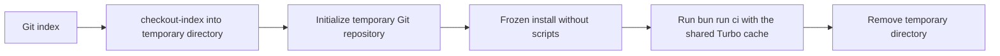

# Scripts and commands

[Documentation index](index.md) · [Architecture](architecture.md)

## Runtime and dependencies

Run commands with Bun and installed dependencies. Root commands run from the repository root; app scripts run with the app directory as the working directory. Most modules use Node-compatible filesystem/process APIs under Bun. The development server runs Vite under Bun, and tests use `bun:test`. Hook scripts require POSIX `sh`; repository checks and the hook require Git. Missing dependencies, files, parse errors, or failed subprocesses generally abort with a nonzero exit rather than being repaired automatically. Environment/output rules are detailed in [SEO and environments](seo-and-environments.md).

## Root commands

The root [package.json](../package.json) holds the Turbo entry points, the repository-wide gates, and formatting.

| Command                    | Implementation                                                                                          | Output, side effects, failure behavior                                                                                                                                                                                                                                                                                                                                                                                                                                                                                                                                                     |
| -------------------------- | ------------------------------------------------------------------------------------------------------- | ------------------------------------------------------------------------------------------------------------------------------------------------------------------------------------------------------------------------------------------------------------------------------------------------------------------------------------------------------------------------------------------------------------------------------------------------------------------------------------------------------------------------------------------------------------------------------------------ |
| `bun run dev`              | `turbo run dev`                                                                                         | Starts both development servers (pulkit.page prefers 3000, pulkit.blog 3001); persistent and never cached                                                                                                                                                                                                                                                                                                                                                                                                                                                                                  |
| `bun run dev:clean`        | `turbo run clean && turbo run dev`                                                                      | Removes every app's outputs and caches, then starts both development servers                                                                                                                                                                                                                                                                                                                                                                                                                                                                                                               |
| `bun run build`            | `turbo run build`                                                                                       | Builds every app into its `dist/`; cached on inputs, restores `dist/**` on a hit                                                                                                                                                                                                                                                                                                                                                                                                                                                                                                           |
| `bun run build:clean`      | `turbo run clean && turbo run build --force`                                                            | Removes outputs and caches, then rebuilds every app without replaying the Turbo cache                                                                                                                                                                                                                                                                                                                                                                                                                                                                                                      |
| `bun run serve`            | `turbo run start`                                                                                       | Builds, then previews each app's `dist/`; persistent and never cached                                                                                                                                                                                                                                                                                                                                                                                                                                                                                                                      |
| `bun run serve:clean`      | `turbo run clean && turbo run start --force`                                                            | Removes outputs and caches, rebuilds without the Turbo cache, then previews each app                                                                                                                                                                                                                                                                                                                                                                                                                                                                                                       |
| `bun run test`             | `turbo run test`                                                                                        | Runs `bun test ./src` in `@pulkit/engine`, `@pulkit/checks`, `@pulkit/theme`, and `@pulkit/shared`                                                                                                                                                                                                                                                                                                                                                                                                                                                                                         |
| `bun run clean`            | `turbo run clean`                                                                                       | Runs each app's `clean` script                                                                                                                                                                                                                                                                                                                                                                                                                                                                                                                                                             |
| `bun run lighthouse`       | `turbo run build` for every app, then [lighthouse.ts](../tooling/lighthouse/src/commands/lighthouse.ts) | Previews each app with a `CNAME` from its `dist/` and audits every route on mobile and desktop in one run, one Chrome per [worker process](../tooling/lighthouse/src/commands/worker.ts) (default half the CPU cores); writes each run to its own folder under ignored `reports/lighthouse/`, named by UTC time and mode such as `2026-09-19T13-44-36Z-prod`, with a Markdown summary, per-page Markdown and HTML reports, and refreshes the run index `reports/lighthouse/README.md`; exits 1 when a page audit reports a runtime error, while low scores are reported rather than failed |
| `bun run lighthouse:prod`  | Same script with `--prod`                                                                               | Audits `https://<CNAME>` for each app, discovering routes from its production sitemap; no build needed                                                                                                                                                                                                                                                                                                                                                                                                                                                                                     |
| `bun run ci`               | `turbo run verify`                                                                                      | Runs every test, build, post-build check, and root gate; see [Turbo tasks](#turbo-tasks)                                                                                                                                                                                                                                                                                                                                                                                                                                                                                                   |
| `bun run format`           | `biome check --write .`, then content checker `--write`                                                 | Can fix code lint issues and formatting, then canonical Markdown/YAML; fails on remaining invalid input                                                                                                                                                                                                                                                                                                                                                                                                                                                                                    |
| `bun run format:check`     | `biome format .`, then content checker                                                                  | Read-only formatting comparison; not the full Biome lint suite                                                                                                                                                                                                                                                                                                                                                                                                                                                                                                                             |
| `bun run lint`             | `biome check --error-on-warnings .`                                                                     | Read-only; warnings fail                                                                                                                                                                                                                                                                                                                                                                                                                                                                                                                                                                   |
| `bun run check:content`    | [check-content.ts](../tooling/checks/src/commands/check-content.ts)                                     | Validates/canonically compares Git-listed Markdown/YAML and content files; read-only                                                                                                                                                                                                                                                                                                                                                                                                                                                                                                       |
| `bun run check:comments`   | [check-comments.ts](../tooling/checks/src/commands/check-comments.ts)                                   | Read-only syntax-aware scan, with article-code exceptions; unsupported scanned languages fail                                                                                                                                                                                                                                                                                                                                                                                                                                                                                              |
| `bun run check:repository` | [check-repository.ts](../tooling/checks/src/commands/check-repository.ts)                               | Checks Git-listed paths, sizes, collisions, symlinks, and text endings                                                                                                                                                                                                                                                                                                                                                                                                                                                                                                                     |
| `bun run check:em-dashes`  | [check-em-dashes.ts](../tooling/checks/src/commands/check-em-dashes.ts)                                 | Rejects U+2014 in text and filenames; no article exemption                                                                                                                                                                                                                                                                                                                                                                                                                                                                                                                                 |
| `bun run check:imports`    | [check-imports.ts](../tooling/checks/src/commands/check-imports.ts)                                     | Parses every tracked JS module under `apps/`, `packages/`, and `tooling/`; resolves static imports/exports                                                                                                                                                                                                                                                                                                                                                                                                                                                                                 |
| `bun run check:dead-code`  | Knip and [knip.json](../knip.json)                                                                      | Reports unused files/exports/dependencies per workspace; config hints also fail                                                                                                                                                                                                                                                                                                                                                                                                                                                                                                            |
| `bun run check:shell`      | `sh -n` on `tooling/checks/install-hooks.sh` and `.githooks/pre-commit`                                 | Syntax only; does not execute their behavior                                                                                                                                                                                                                                                                                                                                                                                                                                                                                                                                               |
| `postinstall`              | [install-hooks.sh](../tooling/checks/install-hooks.sh), run by `bun install`                            | Skips when `CI=true` or `.git` is absent; otherwise sets `core.hooksPath` to `.githooks`                                                                                                                                                                                                                                                                                                                                                                                                                                                                                                   |

`check-content.ts` accepts only an optional `--write`. To run one Turbo task for a single app, filter it, for example `bunx turbo run dev --filter=@pulkit/page` or `bunx turbo run dev --filter=@pulkit/blog`. The Lighthouse script also accepts exact routes, `--site page|blog` (repeatable, app name or domain), `--form-factor mobile|desktop|both`, `--concurrency`, and `--output`.

## App commands

[apps/page/package.json](../apps/page/package.json) and [apps/blog/package.json](../apps/blog/package.json) define the same scripts; the only difference is that the blog's `dev` and `start` scripts set `SITE_PORT=3001`. Each script except `check:html` calls the `site` bin from `@pulkit/engine`. [cli.mjs](../packages/engine/src/cli.mjs) maps the subcommand to a module in `packages/engine/src/` and runs it with Bun in the app directory. Run a script directly with `bun run --cwd apps/page <script>` or `bun run --cwd apps/blog <script>`; direct runs skip Turbo's dependency ordering, so post-build checks need an existing `dist/`.

Because both sites share one layout set, `check:layouts` is a script of [packages/engine/package.json](../packages/engine/package.json) rather than of the apps: `bun src/check-layouts.mjs` runs [check-layouts.mjs](../packages/engine/src/check-layouts.mjs), which expands every template in `packages/theme/layouts/` with sample values, formats and validates the HTML, and throws on failure.

| Script          | Implementation                                                                                                                              | Output, side effects, failure behavior                                                                                                                                                                                           |
| --------------- | ------------------------------------------------------------------------------------------------------------------------------------------- | -------------------------------------------------------------------------------------------------------------------------------------------------------------------------------------------------------------------------------- |
| `dev`           | `site dev`: [dev.mjs](../packages/engine/src/dev.mjs) under `bun --watch`, with [dev-renderer.mjs](../packages/engine/src/dev-renderer.mjs) | Starts Vite on loopback, renders requested routes, caches results, reloads the browser after edits                                                                                                                               |
| `build`         | `site build`: [build.mjs](../packages/engine/src/build.mjs) calls `generateSite` from [generate.mjs](../packages/engine/src/generate.mjs)   | Clears `dist/` except dev roots, renders HTML, cards, sitemap, robots, and the feed when the site has articles with the render cache, then copies and compiles assets; builds demo assets only when a page uses a demo directive |
| `start`         | `site start`: [start.mjs](../packages/engine/src/start.mjs), Vite preview                                                                   | Serves existing `dist/` on loopback, preferring `SITE_PORT` or 3000 like `dev` and trying higher ports when occupied; no compilation or watching; requires a build                                                               |
| `clean`         | `site clean`: [clean.mjs](../packages/engine/src/clean.mjs)                                                                                 | Removes the app's `dist`, `.cache`, `.turbo`, `node_modules/.vite`, and `node_modules/.vite-temp`                                                                                                                                |
| `check:seo`     | `site check-seo`: [check-seo.mjs](../packages/engine/src/check-seo.mjs)                                                                     | Read-only metadata/schema/card/sitemap consistency against `dist/` and the resolved origin                                                                                                                                       |
| `check:site`    | `site check-site`: [check-site.mjs](../packages/engine/src/check-site.mjs) with argument `dist`                                             | Reads HTML/CSS local references; prints failures, exits 1; no network checking                                                                                                                                                   |
| `check:html`    | html-validate on `dist/**/*.html`                                                                                                           | Read-only; requires a prior build                                                                                                                                                                                                |
| `check:browser` | `site check-browser`: [check-browser.mjs](../packages/engine/src/check-browser.mjs) driving Chromium through Playwright                     | Read-only smoke audit of the built site; `BROWSER_VIEWPORT` and `BROWSER_SHARD` narrow the work, and `PLAYWRIGHT_CHANNEL=chrome` uses an installed Chrome instead of the Playwright download                                     |

## Turbo tasks

[turbo.json](../turbo.json) defines the graph. Workspace packages have no build output, so a `transit` task that depends on `^transit` exists only to connect them: `build`, `test`, and `check:layouts` depend on `^transit`, which folds the source hash of every workspace dependency into the task hash. Editing any file in `packages/engine`, `packages/theme`, `packages/shared`, `packages/code`, `packages/embeds`, `packages/demos`, or `packages/profile` (all dependencies of the engine) therefore invalidates the dependent app builds. `biome.json` and `.htmlvalidate.json` are global dependencies, and `NODE_ENV` and `SITE_URL` are global environment inputs. Two workspaces extend the root configuration: [apps/page/turbo.json](../apps/page/turbo.json) adds `$TURBO_ROOT$/apps/blog/content/**` to its build inputs because the portfolio home lists the newest posts, and [tooling/checks/turbo.json](../tooling/checks/turbo.json) adds the workflow, hook, and manifest files that its policy tests read to the inputs of its `test`.

| Task                                                     | Depends on                                                       | Cache                                                        |
| -------------------------------------------------------- | ---------------------------------------------------------------- | ------------------------------------------------------------ |
| `build`                                                  | `^transit`                                                       | Outputs `dist/**`; `.cache/**` is not an input               |
| `test`, `check:layouts`                                  | `^transit`                                                       | No outputs                                                   |
| `check:seo`, `check:site`, `check:html`, `check:browser` | `build`                                                          | No outputs; `check:browser` also hashes `PLAYWRIGHT_CHANNEL` |
| `dev`, `start`                                           | `start` needs `build`                                            | Never cached, persistent                                     |
| `clean`                                                  | Nothing                                                          | Never cached                                                 |
| `//#format:check`, `//#lint`, `//#check:*`               | Nothing                                                          | Root tasks, no outputs                                       |
| `verify`                                                 | Everything above except `check:browser`, `dev`, `start`, `clean` | No outputs                                                   |

`verify` collects `test`, `check:layouts`, `check:seo`, `check:site`, `check:html`, and the root tasks `format:check`, `lint`, `check:content`, `check:comments`, `check:repository`, `check:em-dashes`, `check:imports`, `check:dead-code`, and `check:shell`. Turbo runs independent tasks in parallel and, by default, stops scheduling new tasks after the first failure, so later checks are not implied to have passed. A new check only runs in CI and the hook once it is added to `verify`. Tests and builds create temporary and output files, so the overall command is not filesystem read-only even though validation stages are. `check:browser` stays outside `verify` because it needs a browser installation; CI runs it in its own job.

## Supporting modules

| File                                                                | Called by                                  | Responsibility                                                                                                                         |
| ------------------------------------------------------------------- | ------------------------------------------ | -------------------------------------------------------------------------------------------------------------------------------------- |
| [render-page.mjs](../packages/engine/src/render-page.mjs)           | Generator, dev renderer, tests             | `readPage`, `renderPage`, `collectionItems`, and `renderDependencies`; YAML, Marked, list/embed/demo/carousel extensions               |
| [markdown-export.mjs](../packages/engine/src/markdown-export.mjs)   | Generator and dev renderer                 | A portable Markdown copy of every page plus `llms.txt`; fails when an embed or tag has no Markdown fallback                            |
| [html.ts](../packages/shared/src/browser/html.ts)                   | Engine, embeds, code, checks               | `escapeHtml`, the one HTML escaping helper                                                                                             |
| [built-site.ts](../packages/shared/src/node/built-site.ts)          | Site check, browser check, Lighthouse      | `builtRoutes` and `builtFiles` walk a built `dist/`, skipping `assets` and development roots                                           |
| [site-inventory.mjs](../packages/engine/src/site-inventory.mjs)     | Generator, dev renderer, checks            | Walks `content/`, validates routes; `readSiteConfig` merges `@pulkit/profile` with `_site.md` and adds the RSS link                    |
| [layouts.mjs](../packages/engine/src/layouts.mjs)                   | Renderer, generator, layout checker, tests | Placeholder names, `layoutDirectory`, `loadLayouts`, and `applyLayout` implement template handling                                     |
| [generation-cache.mjs](../packages/engine/src/generation-cache.mjs) | Generator and dev renderer                 | Checksummed render cache under `.cache/generate/`, versioned by package sources, showcases, `biome.json`, `bun.lock`, font             |
| [site-origin.mjs](../packages/engine/src/site-origin.mjs)           | Generator, build, SEO checker, tests       | Validates CNAME, `SITE_URL`, or `NODE_ENV` origin                                                                                      |
| [seo.mjs](../packages/engine/src/seo.mjs)                           | Renderer, cards, checker, tests            | Full title, card paths, article and category detection, ancestors, related scores, graph construction, safe JSON                       |
| [og-images.mjs](../packages/engine/src/og-images.mjs)               | Generator and tests                        | Card categories, resvg PNG rasterization with the bundled TTF, sitemap, robots, and Atom feed buffers                                  |
| [files.ts](../packages/theme/src/lib/files.ts)                      | Build, dev server, layouts, cards, embeds  | `themeFile` resolves files inside `@pulkit/theme`; `assetFile` maps `/assets/...` to the app's assets, then the theme's                |
| [highlight.ts](../packages/code/src/highlight/highlight.ts)         | Renderer, demos, tests                     | Build-time fence highlighting: Shiki grammars for known languages, classed spans, plain escape otherwise                               |
| [format-code.ts](../packages/code/src/format/format-code.ts)        | Renderer, demos, tests                     | Generate-time fence hygiene, then Biome's JavaScript API (loaded lazily) for supported languages; parse failures keep the hygiene text |
| [format-html.ts](../packages/code/src/format/format-html.ts)        | Renderer and layout checker                | A parse5 printer: indents blocks, keeps prose and inline runs on one line, leaves raw text elements untouched                          |
| [index.mjs](../packages/embeds/src/index.mjs)                       | Renderer and content checker               | Embed parsing and rendering through [registry.mjs](../packages/embeds/src/registry.mjs)                                                |
| [bundle.mjs](../packages/embeds/src/bundle.mjs)                     | Build and dev server                       | `bundleEmbedScripts` and `buildEmbedAssets` for `client/*.js`, KaTeX, and PhotoSwipe under `/assets/embeds/`                           |
| [render.mjs](../packages/demos/src/render.mjs)                      | Renderer                                   | Renders a `:::demo` block from `showcases/*.json`, with highlighted source files                                                       |
| [assets.mjs](../packages/demos/src/assets.mjs)                      | Build and dev server                       | Compiles demo CSS, serves Poppins fonts, bundles demo scripts to `/assets/demos/`                                                      |
| [repository.ts](../packages/shared/src/node/repository.ts)          | Comment and em-dash CLIs                   | Git inventory, signature-based binary exemptions, strict UTF-8 reading                                                                 |

Tests live beside the modules they cover: `packages/engine/src/*.test.js`, `tooling/checks/src/**/*.test.ts`, `packages/theme/src/lib/files.test.ts`, and `packages/shared/src/**/*.test.ts`. The engine's [bunfig.toml](../packages/engine/bunfig.toml) preloads [test/setup.mjs](../packages/engine/test/setup.mjs), which changes into `test/fixture/` (layouts, `content/_site.md`, and CNAME) so engine tests run against a small app. Engine tests use a 30 second timeout because the first fence test loads Shiki grammars and Biome's WebAssembly. See [quality checks](quality-checks.md#regression-coverage) for what each test file covers.

## Development server details

The development server runs in the app directory and binds Vite to `127.0.0.1`. Unset PORT prefers `SITE_PORT` when set, otherwise 3000, and tries higher ports when occupied; pulkit.blog's `dev` script sets `SITE_PORT=3001` so both sites run side by side. Explicit occupied ports fail; PORT=0 requests an available port. Canonical URLs use the actual bound origin. Vite's file access is limited to the app directory and the repository root, so workspace packages can be served.

HTML and cards render only when requested. CSS, embed and demo bundles, and the app's own assets are served through Vite; `/theme.js`, `/favicon.ico`, and `/assets/` files found only in `packages/theme/assets/` are served straight from the theme, with an app asset taking precedence over a shared one of the same path; crawler responses (sitemap, robots, and `/feed.xml` for sites with articles) use the current inventory without generating cards. GET/HEAD are supported; other methods return 405, malformed URI escapes return 400, and unknown routes return 404. Slash redirects preserve query strings. HTML and generated assets use no-store.

Request logs show local timestamps and one summary per page: method, URL, HTTP status, compiled/rebuilt/cached result, compilation duration when applicable, and total server response time. Total includes page lookup and response preparation; it does not measure browser painting or subsequent asset downloads. Successful static asset and Vite internal requests are hidden. Failures remain visible, and changed source files receive a short notice.

Content and layout edits invalidate inventory and reload the browser. Dependency keys preserve unaffected render results. Vite provides CSS hot replacement and watches source assets; `bun --watch` restarts the server when imported engine code changes. Package sources, Biome configuration, the lockfile, and fonts invalidate caches. Rendering errors return 500 for the requested page and later requests can retry after fixes. SIGINT/SIGTERM close the server and its watchers. Development writes cache entries under the app's `.cache/`, without writing HTML into `dist/`.

## Staged-snapshot pre-commit

The [hook](../.githooks/pre-commit) requires Bun and an existing root `node_modules`. It exports the entire Git index using `git checkout-index`, clears inherited Git-location variables in a subshell, initializes a temporary repository, and stages its files for Git-based scanners. It then runs `bun install --frozen-lockfile --ignore-scripts` in the snapshot and `bun run ci` with `TURBO_CACHE_DIR` set to the repository's `.turbo/cache`, so tasks whose inputs match an earlier run replay from cache. Traps remove the temporary directory on exit/signals.

It neither stages repairs nor changes the original index/worktree. If a correction exists only unstaged, the staged version still fails; the [pre-commit test](../tooling/checks/src/pre-commit.test.js) covers this. Untracked documentation is checked by local CI but will not be in a commit snapshot until staged. Installation can fail rather than overwrite a different `core.hooksPath`; integrate deliberately if using another hook manager.

## GitHub Actions

The [workflow](../.github/workflows/ci.yml) runs on pull requests, merge groups, pushes to main, and manual dispatch. All jobs use Ubuntu 26.04, and Bun jobs install Bun 1.4.2 with `bun install --frozen-lockfile`, restoring Bun's package cache keyed on `bun.lock`.

- Verify restores the Turbo cache and each app's render cache from the most recent run, runs `bun run ci`, drops Turbo entries older than a week so the cache stays bounded, and uploads `apps/*/dist` (both sites) as the `built-sites` artifact.
- Browser smoke downloads `built-sites` into `apps/` and runs `bunx turbo run check:browser --only`, so the build is not repeated. It is a matrix of the `desktop` and `mobile` viewports crossed with the `1/2` and `2/2` shards, with `fail-fast: false`, and sets `PLAYWRIGHT_CHANNEL=chrome` so Playwright drives the runner's Chrome instead of downloading a browser.
- Workflow lint runs actionlint 1.7.12 with Go 1.27, Workflow security runs zizmor with `--persona=pedantic --min-severity=high`, Secrets runs Gitleaks, Dependency audit runs `bun audit --audit-level=high`, and ShellCheck checks the hook scripts. The actionlint configuration registers the Ubuntu 26.04 label because actionlint 1.7.12 does not include it in its built-in runner list.

The `CI` gate depends on all jobs and fails for failure, cancellation, or skipped results. Two deploy jobs depend on that gate and run only on main push or manual dispatch, downloading the run's `built-sites` artifact. Deploy pulkit.page receives `pages: write` and `id-token: write`, configures Pages, and deploys the artifact in the `github-pages` environment. Deploy pulkit.blog pushes `apps/blog/dist` to the `gh-pages` branch of pulkitxm/pulkit.blog with the `BLOG_DEPLOY_KEY` deploy key, see [deployment](deployment.md). Actions are pinned to commit hashes. CI concurrency groups by pull request number or ref and cancels the older run on every event, including pushes to main and an older run's deploy jobs; both deploys are atomic, so the previous site stays live until the newer run deploys. These YAML intentions do not establish remote branch protection, environment approvals, or DNS state. [Continuous integration](continuous-integration.md) describes the jobs and the run graph in full.

Builds and Vite development share the checksummed render cache in the app's `.cache/generate/`. It can be deleted to force a cold render; it is never needed for correctness. Builds reuse HTML, fences, and cards and report counts of newly computed cached items; an empty count means all results were reused.
